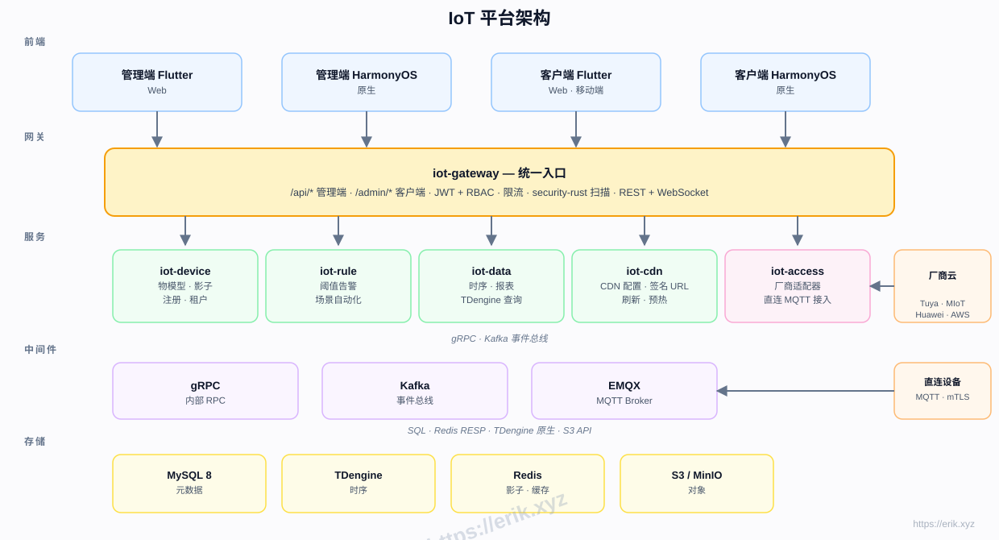
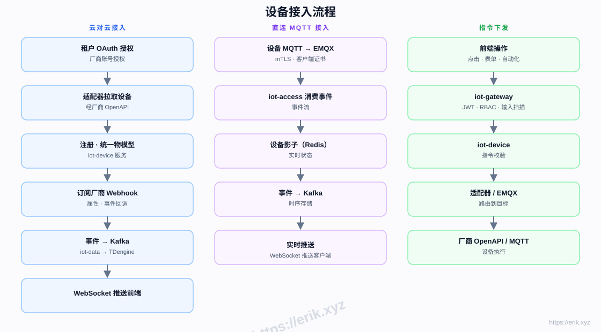
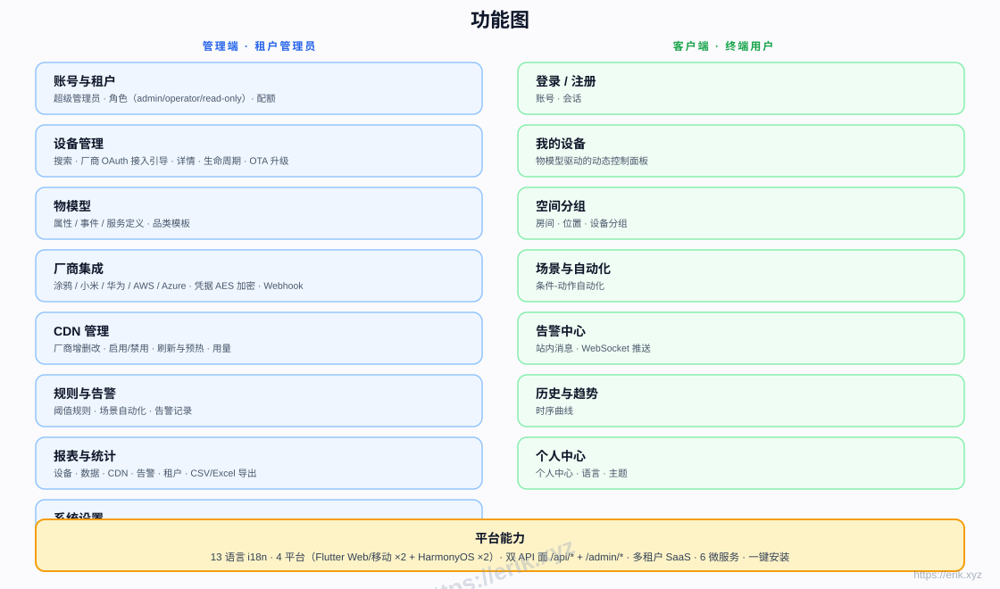
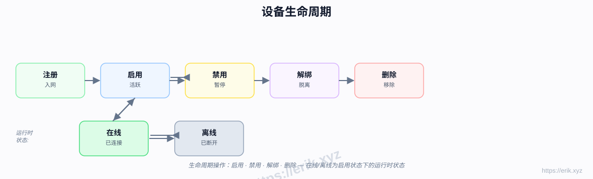
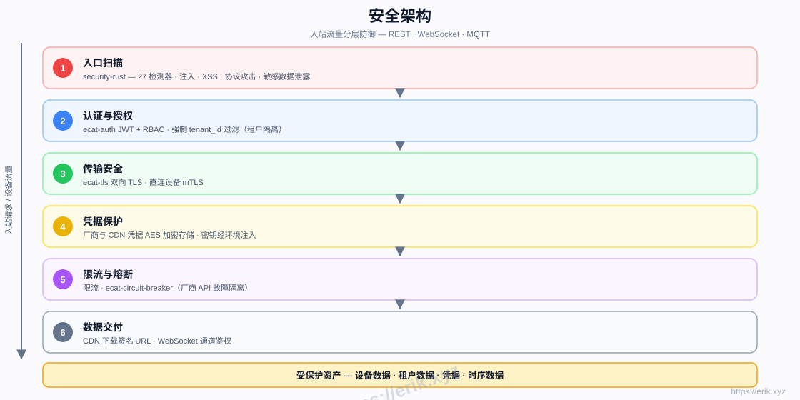

# IoT 物联网管理平台

[中文](README.md) | [English](docs/i18n/README.en.md) | [한국어](docs/i18n/README.ko.md) | [Русский](docs/i18n/README.ru.md) | [Deutsch](docs/i18n/README.de.md) | [Français](docs/i18n/README.fr.md) | [Español](docs/i18n/README.es.md) | [Português](docs/i18n/README.pt.md) | [हिन्दी](docs/i18n/README.hi.md) | [العربية](docs/i18n/README.ar.md) | [বাংলা](docs/i18n/README.bn.md) | [Bahasa Indonesia](docs/i18n/README.id.md) | [日本語](docs/i18n/README.ja.md)

<p align="center">
  
</p>

统一接入国内外主流设备厂商（涂鸦、小米、华为、AWS IoT、Azure IoT 等），提供设备管理、物模型、规则告警、时序数据、CDN 分发与多端应用的一站式 SaaS 物联网平台。后端为 Rust 微服务（e-cat 工作区），前端为 Flutter + HarmonyOS 双端，支持 13 种语言。

## 功能特性

- **多厂商接入**：云对云 OAuth 接入（涂鸦 / 小米 / 华为 / AWS / Azure）+ 直连 MQTT（mTLS）
- **物模型**：属性 / 事件 / 服务统一建模，管理端建模、客户端动态渲染
- **设备生命周期**：注册 → 启用 / 禁用 → 解绑 → 删除，运行时在线 / 离线状态
- **规则与告警**：阈值规则、场景自动化、WebSocket 实时推送
- **数据与报表**：TDengine 时序存储、历史曲线、CSV/Excel 导出
- **CDN 管理**：厂商配置、启用 / 禁用、刷新与预热、签名 URL
- **多租户 SaaS**：租户隔离、配额、角色权限（admin / operator / read-only）
- **安全**：security-rust 入站扫描、JWT + RBAC、双向 TLS、凭据 AES 加密、限流与熔断
- **13 语言 i18n**，Flutter Web / Mobile 与 HarmonyOS 原生四端

## 架构图



## 设备接入流程图



## 功能图



## 生命周期图



## 安全架构



## 技术栈

| 层 | 技术 |
|----|------|
| 前端 | Flutter（Web / Mobile）· HarmonyOS ArkTS |
| 后端 | Rust（axum · tokio · gRPC）· security-rust 安全扫描 |
| 中间件 | EMQX（MQTT）· Kafka（事件总线）· gRPC（内部 RPC） |
| 存储 | MySQL 8（元数据）· TDengine（时序）· Redis（影子 / 缓存）· S3 / MinIO（对象） |
| 接入 | 云对云 OAuth 适配器 · 直连 MQTT（mTLS） |

## 目录结构

```
├── apps/            # 前端应用
│   ├── admin/       # 管理端（Flutter + HarmonyOS）
│   └── client/      # 客户端（Flutter + HarmonyOS）
├── e-cat/           # Rust 工作区（微服务 + 公共库）
│   └── services/    # iot-gateway · iot-device · iot-access · iot-rule · iot-data · iot-cdn
├── docs/            # 文档、架构图、打赏图片
├── scripts/         # 构建 / 校验 / 冒烟测试脚本
└── docker-compose.yml  # 基础设施编排（MySQL / Redis / EMQX / Kafka / MinIO）
```

## 实施阶段

| 阶段 | 内容 |
|------|------|
| P0 骨架 | 仓库结构、iot-gateway + iot-device + Docker 编排（MySQL/Redis/EMQX/Kafka/MinIO） |
| P1 接入 | iot-access + 涂鸦适配器 + 直连 MQTT |
| P2 数据 | iot-data + TDengine + 历史曲线 |
| P3 规则 | iot-rule 告警 + 场景自动化 |
| P4 多厂商 + CDN | 小米/华为/AWS/Azure 适配器 + iot-cdn |
| P5 前端 | apps/admin + apps/client 全端 |
| P6 上线 | 安全加固、压测、OTA |

## 支持与打赏

您的支持是项目持续发展的动力，欢迎打赏，万分感谢！

### 扫码打赏（微信 / 支付宝）

<p>
  
  
</p>

微信支付（WeChat Pay） · 支付宝（Alipay）

### 全球转账打赏（银行汇款）

**【收款人信息】**
收款人姓名：WANG KEXUN
收款账户号码：881015918251

**【收款银行】ZA Bank**
- SWIFT Code：AABLHKHHXXX
- 银行名称：ZA Bank Limited
- 银行编号：387
- 银行地址：Core F, Cyberport 3, 100 Cyberport Road, Hong Kong

**【跨境汇款代理银行（如需）】**
请留意，此为跨境汇款代理银行（中转银行）信息，非收款银行信息。请向汇款银行查询是否需要提供跨境汇款代理银行信息。

- **汇入港元、人民币及美元的代理银行为 Citibank**
  - 银行名称：Citibank N.A. Hong Kong
  - SWIFT Code：CITIHKHXXXX
  - 银行编号：006
  - 分行名称：Hong Kong Branch
  - 分行编号：391
  - 银行地址：Citibank Tower, Citibank Plaza, 3 Garden Road, Central, Hong Kong

- **汇入其他币种时的代理银行为 BNY Mellon**
  - 银行名称：THE BANK OF NEW YORK MELLON
  - SWIFT Code：IRVTUS3NXXX
  - 银行地址：THE BANK OF NEW YORK MELLON, 240 GREENWICH STREET, NEW YORK, United States

### 虚拟币打赏（加密货币）

<p align="center">
  
  
  
  
  
  
  
  
  
  
</p>

| 主网 | 钱包地址 |
|------|----------|
| BNB Smart Chain (BEP20) | `0x355d429f97511897ccb4e271ec888205f9ab6629` |
| Tron (TRC20) | `TEdDHWLajt1XvqtPDWmQctdrJaC3pzZZzz` |
| Ethereum (ERC20) | `0x355d429f97511897ccb4e271ec888205f9ab6629` |
| Aptos | `0x836e3780edfc3f7b2372b39e2a1a3a5d7adfaccd96c726f21cfde1b50dd68030` |
| Plasma | `0x355d429f97511897ccb4e271ec888205f9ab6629` |
| Polygon POS | `0x355d429f97511897ccb4e271ec888205f9ab6629` |
| Solana | `2hfhboHdmdrYsY25XfQSsEWxq5ip4EQsR7f4AzSRMUyr` |
| The Open Network (TON) | `UQB9kFQohzmXUir9QSSZq01iwl9aQZIDdBpNmDklljRtCoGK` |
| Arbitrum One | `0x355d429f97511897ccb4e271ec888205f9ab6629` |
| AVAX C-Chain | `0x355d429f97511897ccb4e271ec888205f9ab6629` |

## 许可

本项目代码仅供学习交流使用。
