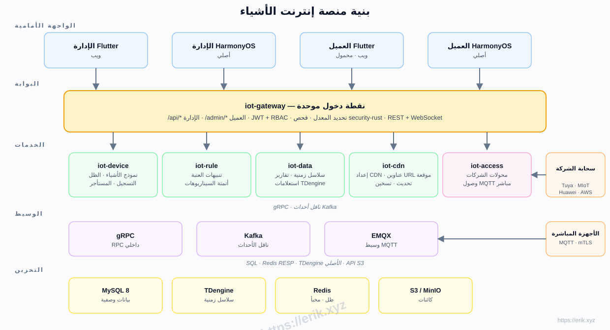
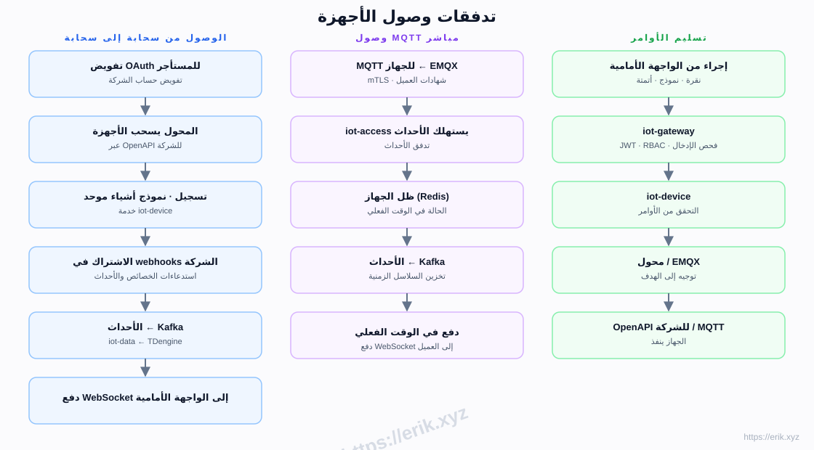
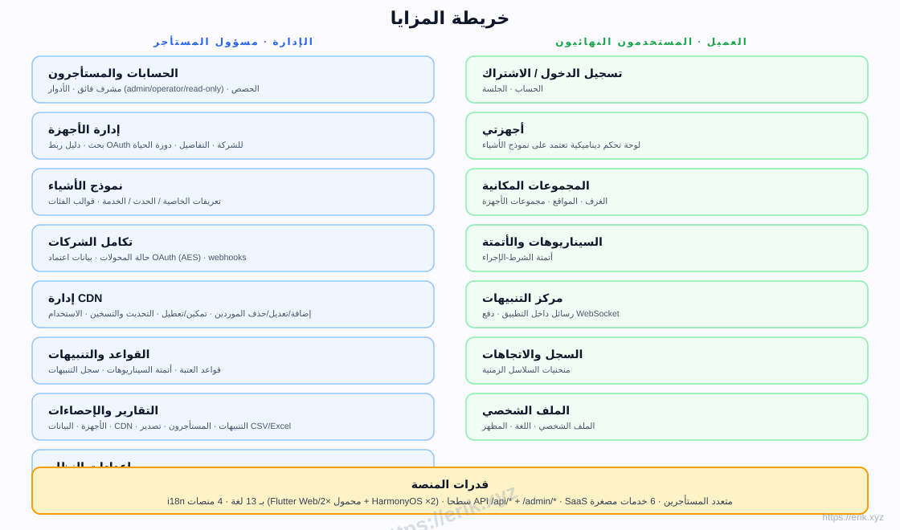
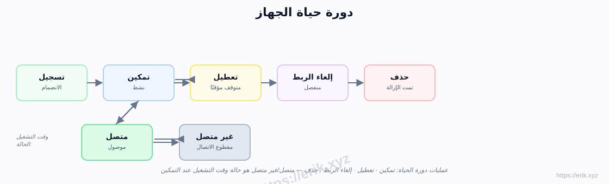
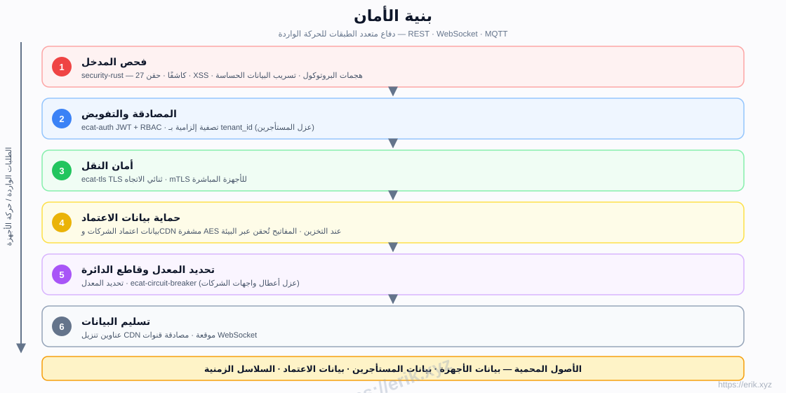

# منصة إنترنت الأشياء

[中文](../../README.md) | [English](README.en.md) | [한국어](README.ko.md) | [Русский](README.ru.md) | [Deutsch](README.de.md) | [Français](README.fr.md) | [Español](README.es.md) | [Português](README.pt.md) | [हिन्दी](README.hi.md) | [العربية](README.ar.md) | [বাংলা](README.bn.md) | [Bahasa Indonesia](README.id.md) | [日本語](README.ja.md)

<p align="center">
  
</p>

منصة SaaS شاملة لإنترنت الأشياء توحّد الوصول إلى كبرى شركات تصنيع الأجهزة المحلية والعالمية (Tuya وXiaomi وHuawei وAWS IoT وAzure IoT وغيرها)، وتوفر إدارة الأجهزة ونماذج الأشياء والقواعد والتنبيهات وبيانات السلاسل الزمنية وتوزيع CDN وتطبيقات متعددة المنصات. الواجهة الخلفية هي مساحة عمل للخدمات المصغرة بلغة Rust (e-cat)، والواجهات الأمامية هي Flutter + HarmonyOS، مع دعم 13 لغة.

## المزايا

- **الوصول متعدد الشركات**: OAuth من السحابة إلى السحابة (Tuya / Xiaomi / Huawei / AWS / Azure) + MQTT مباشر (mTLS)
- **نموذج الأشياء**: نمذجة موحدة للخاصية / الحدث / الخدمة — النمذجة في لوحة الإدارة، والعرض الديناميكي في العميل
- **دورة حياة الجهاز**: تسجيل ← تمكين / تعطيل ← إلغاء الربط ← حذف، مع حالة متصل / غير متصل وقت التشغيل
- **القواعد والتنبيهات**: قواعد العتبة، أتمتة السيناريوهات، دفع WebSocket في الوقت الفعلي
- **البيانات والتقارير**: تخزين السلاسل الزمنية TDengine، منحنيات السجل، تصدير CSV/Excel
- **إدارة CDN**: إعداد المورد، تمكين / تعطيل، التحديث والتسخين، عناوين URL موقعة
- **SaaS متعدد المستأجرين**: عزل المستأجرين، الحصص، الأدوار (admin / operator / read-only)
- **الأمان**: فحص وارد security-rust، JWT + RBAC، TLS ثنائي الاتجاه، بيانات اعتماد مشفرة AES، تحديد المعدل وقاطع الدائرة
- **i18n بـ 13 لغة**، Flutter Web / Mobile و HarmonyOS الأصلي (4 تطبيقات)

## البنية المعمارية



## تدفقات وصول الأجهزة



## خريطة المزايا



## دورة حياة الجهاز



## بنية الأمان



## حزمة التقنيات

| الطبقة | التقنية |
|----|------|
| الواجهة الأمامية | Flutter (Web / Mobile) · HarmonyOS ArkTS |
| الواجهة الخلفية | Rust (axum · tokio · gRPC) · فحص security-rust |
| الوسيط | EMQX (MQTT) · Kafka (ناقل الأحداث) · gRPC (RPC داخلي) |
| التخزين | MySQL 8 (بيانات وصفية) · TDengine (سلاسل زمنية) · Redis (ظل / مخبأ) · S3 / MinIO (كائنات) |
| الوصول | محولات OAuth من سحابة إلى سحابة · MQTT مباشر (mTLS) |

## هيكل المستودع

```
├── apps/            # تطبيقات الواجهة الأمامية
│   ├── admin/       # وحدة التحكم الإدارية (Flutter + HarmonyOS)
│   └── client/      # تطبيق العميل (Flutter + HarmonyOS)
├── e-cat/           # مساحة عمل Rust (خدمات مصغرة + صناديق مشتركة)
│   └── services/    # iot-gateway · iot-device · iot-access · iot-rule · iot-data · iot-cdn
├── ../            # الوثائق والرسوم البيانية وصور التبرعات
├── scripts/         # نصوص البناء / التحقق / اختبارات الدخان
└── docker-compose.yml  # البنية التحتية (MySQL / Redis / EMQX / Kafka / MinIO)
```

## مراحل التنفيذ

| المرحلة | النطاق |
|------|------|
| P0 الهيكل | هيكل المستودع، iot-gateway + iot-device + تنسيق Docker (MySQL/Redis/EMQX/Kafka/MinIO) |
| P1 الوصول | iot-access + محول Tuya + MQTT مباشر |
| P2 البيانات | iot-data + TDengine + منحنيات السجل |
| P3 القواعد | تنبيهات iot-rule + أتمتة السيناريوهات |
| P4 متعدد الشركات + CDN | محولات Xiaomi/Huawei/AWS/Azure + iot-cdn |
| P5 الواجهة الأمامية | apps/admin + apps/client بالكامل |
| P6 الإطلاق | تقوية الأمان، اختبار الحمل، OTA |

## الدعم والتبرعات

دعمكم هو قوة دفع استمرار المشروع. التبرعات مرحب بها، شكرًا جزيلاً!

### التبرع بمسح رمز QR (WeChat Pay / Alipay)

<p>
  
  
</p>

WeChat Pay · Alipay

### تحويل مصرفي دولي

**【معلومات المستلم】**
اسم المستلم: WANG KEXUN
رقم الحساب: 881015918251

**【البنك المستلم】ZA Bank**
- رمز SWIFT: AABLHKHHXXX
- اسم البنك: ZA Bank Limited
- رمز البنك: 387
- عنوان البنك: Core F, Cyberport 3, 100 Cyberport Road, Hong Kong

**【البنك المراسل للتحويلات الدولية (إذا لزم الأمر)**】**
يرجى ملاحظة أن هذه معلومات البنك المراسل (الوسيط) للتحويلات الدولية، وليست البنك المستلم. يرجى الاستفسار من البنك المحوِّل ما إذا كانت معلومات البنك المراسل مطلوبة.

- **بالنسبة للتحويلات بالدولار الهونغ كونغي HKD واليوان CNY والدولار USD، البنك المراسل هو Citibank**
- اسم البنك: Citibank N.A. Hong Kong
- رمز SWIFT: CITIHKHXXXX
- رمز البنك: 006
- اسم الفرع: Hong Kong Branch
- رمز الفرع: 391
- عنوان البنك: Citibank Tower, Citibank Plaza, 3 Garden Road, Central, Hong Kong

- **بالنسبة للتحويلات بالعملات الأخرى، البنك المراسل هو BNY Mellon**
- اسم البنك: THE BANK OF NEW YORK MELLON
- رمز SWIFT: IRVTUS3NXXX
- عنوان البنك: THE BANK OF NEW YORK MELLON, 240 GREENWICH STREET, NEW YORK, United States

### التبرعات بالعملات المشفرة

<p align="center">
  
  
  
  
  
  
  
  
  
  
</p>

| الشبكة | عنوان المحفظة |
|------|----------|
| BNB Smart Chain (BEP20) | `0x355d429f97511897ccb4e271ec888205f9ab6629` |
| Tron (TRC20) | `TEdDHWLajt1XvqtPDWmQctdrJaC3pzZZzz` |
| Ethereum (ERC20) | `0x355d429f97511897ccb4e271ec888205f9ab6629` |
| Aptos | `0x836e3780edfc3f7b2372b39e2a1a3a5d7adfaccd96c726f21cfde1b50dd68030` |
| Plasma | `0x355d429f97511897ccb4e271ec888205f9ab6629` |
| Polygon POS | `0x355d429f97511897ccb4e271ec888205f9ab6629` |
| Solana | `2hfhboHdmdrYsY25XfQSsEWxq5ip4EQsR7f4AzSRMUyr` |
| The Open Network (TON) | `UQB9kFQohzmXUir9QSSZq01iwl9aQZIDdBpNmDklljRtCoGK` |
| Arbitrum One | `0x355d429f97511897ccb4e271ec888205f9ab6629` |
| AVAX C-Chain | `0x355d429f97511897ccb4e271ec888205f9ab6629` |

## الترخيص

يُقدَّم كود هذا المشروع لأغراض التعلم وتبادل المعرفة فقط.
