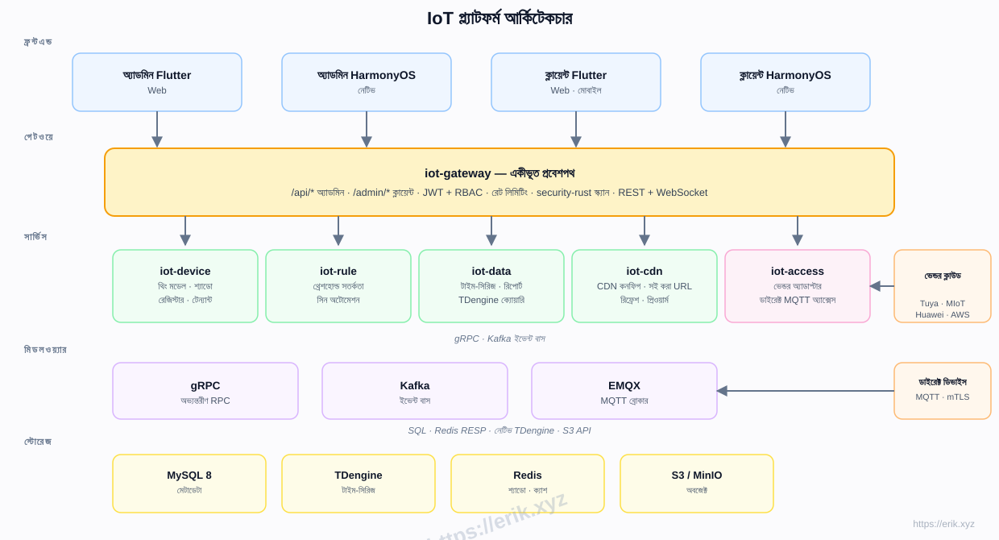
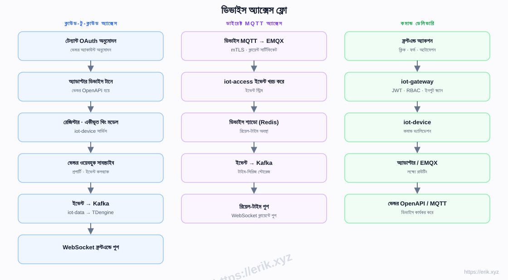
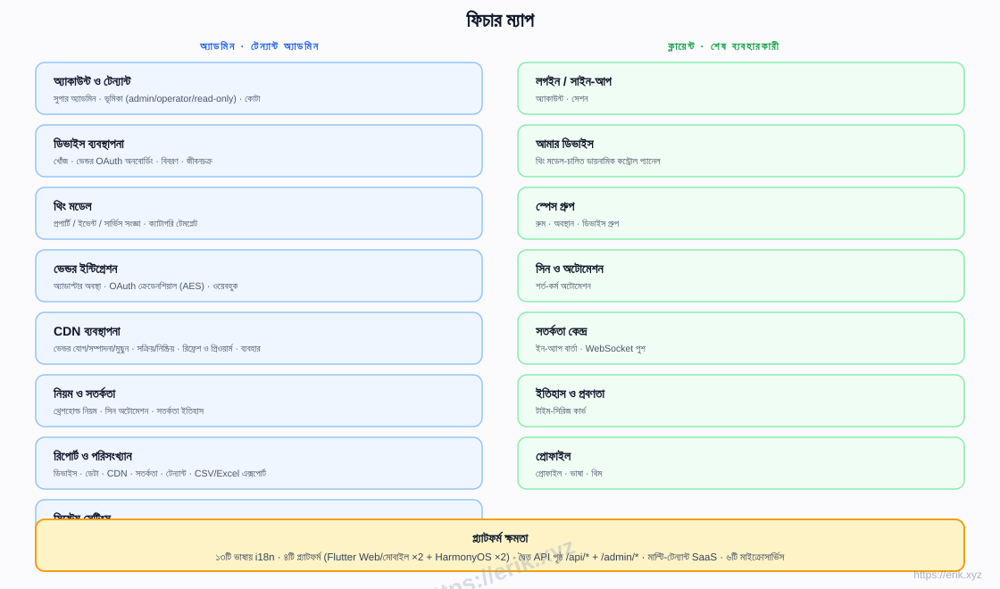
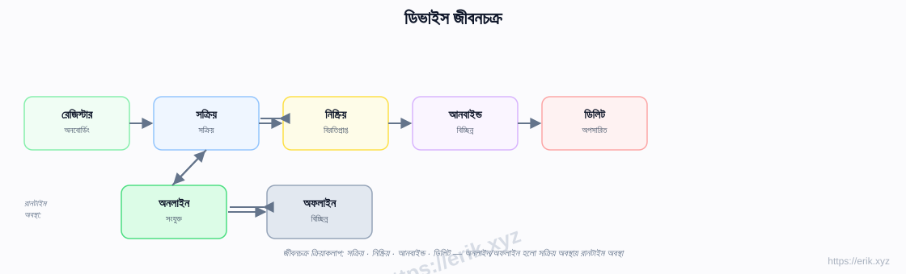
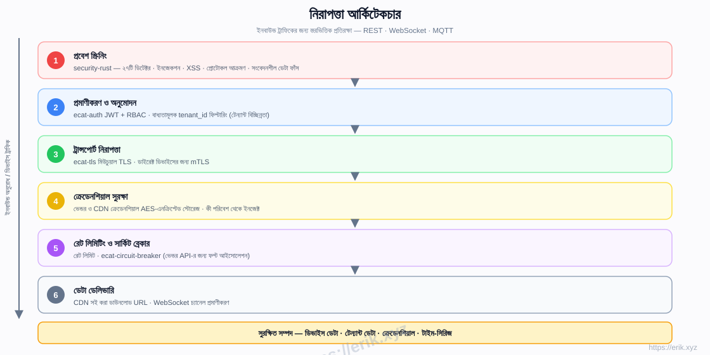

# IoT প্ল্যাটফর্ম

[中文](../../README.md) | [English](README.en.md) | [한국어](README.ko.md) | [Русский](README.ru.md) | [Deutsch](README.de.md) | [Français](README.fr.md) | [Español](README.es.md) | [Português](README.pt.md) | [हिन्दी](README.hi.md) | [العربية](README.ar.md) | [বাংলা](README.bn.md) | [Bahasa Indonesia](README.id.md) | [日本語](README.ja.md)

<p align="center">
  
</p>

একটি অল-ইন-ওয়ান SaaS IoT প্ল্যাটফর্ম যা দেশি ও বিদেশি প্রধান ডিভাইস নির্মাতাদের (Tuya, Xiaomi, Huawei, AWS IoT, Azure IoT ইত্যাদি) সঙ্গে একীভূত সংযোগ প্রদান করে, যার মধ্যে রয়েছে ডিভাইস ব্যবস্থাপনা, থিং মডেল, নিয়ম ও সতর্কতা, টাইম-সিরিজ ডেটা, CDN ডেলিভারি এবং মাল্টি-প্ল্যাটফর্ম অ্যাপ। ব্যাকএন্ড হলো Rust মাইক্রোসার্ভিস ওয়ার্কস্পেস (e-cat), ফ্রন্টএন্ড হলো Flutter + HarmonyOS, ১৩টি ভাষার সমর্থনসহ।

## বৈশিষ্ট্যসমূহ

- **মাল্টি-ভেন্ডর অ্যাক্সেস**: ক্লাউড-টু-ক্লাউড OAuth (Tuya / Xiaomi / Huawei / AWS / Azure) + ডাইরেক্ট MQTT (mTLS)
- **থিং মডেল**: প্রপার্টি / ইভেন্ট / সার্ভিসের একীভূত মডেলিং — অ্যাডমিনে মডেলিং, ক্লায়েন্টে ডায়নামিক রেন্ডারিং
- **ডিভাইস জীবনচক্র**: রেজিস্টার → সক্রিয় / নিষ্ক্রিয় → আনবাইন্ড → ডিলিট, রানটাইমে অনলাইন / অফলাইন অবস্থা
- **নিয়ম ও সতর্কতা**: থ্রেশহোল্ড নিয়ম, সিন অটোমেশন, WebSocket রিয়েল-টাইম পুশ
- **ডেটা ও রিপোর্ট**: TDengine টাইম-সিরিজ স্টোরেজ, হিস্ট্রি কার্ভ, CSV/Excel এক্সপোর্ট
- **CDN ব্যবস্থাপনা**: ভেন্ডর কনফিগ, সক্রিয় / নিষ্ক্রিয়, রিফ্রেশ ও প্রিওয়ার্ম, সই করা URL
- **মাল্টি-টেন্যান্ট SaaS**: টেন্যান্ট বিচ্ছিন্নতা, কোটা, ভূমিকা (admin / operator / read-only)
- **নিরাপত্তা**: security-rust ইনবাউন্ড স্ক্যানিং, JWT + RBAC, মিউচুয়াল TLS, AES-এনক্রিপ্টেড ক্রেডেনশিয়াল, রেট লিমিটিং ও সার্কিট ব্রেকার
- **১৩টি ভাষায় i18n**, Flutter Web / Mobile ও নেটিভ HarmonyOS (৪টি অ্যাপ)

## আর্কিটেকচার



## ডিভাইস অ্যাক্সেস ফ্লো



## ফিচার ম্যাপ



## ডিভাইস জীবনচক্র



## নিরাপত্তা আর্কিটেকচার



## টেক স্ট্যাক

| স্তর | প্রযুক্তি |
|----|------|
| ফ্রন্টএন্ড | Flutter (Web / Mobile) · HarmonyOS ArkTS |
| ব্যাকএন্ড | Rust (axum · tokio · gRPC) · security-rust স্ক্যানিং |
| মিডলওয়্যার | EMQX (MQTT) · Kafka (ইভেন্ট বাস) · gRPC (অভ্যন্তরীণ RPC) |
| স্টোরেজ | MySQL 8 (মেটাডেটা) · TDengine (টাইম-সিরিজ) · Redis (শ্যাডো / ক্যাশ) · S3 / MinIO (অবজেক্ট) |
| অ্যাক্সেস | ক্লাউড-টু-ক্লাউড OAuth অ্যাডাপ্টার · ডাইরেক্ট MQTT (mTLS) |

## রিপোজিটরি কাঠামো

```
├── apps/            # ফ্রন্টএন্ড অ্যাপ
│   ├── admin/       # অ্যাডমিন কনসোল (Flutter + HarmonyOS)
│   └── client/      # ক্লায়েন্ট অ্যাপ (Flutter + HarmonyOS)
├── e-cat/           # Rust ওয়ার্কস্পেস (মাইক্রোসার্ভিস + শেয়ার্ড ক্রেট)
│   └── services/    # iot-gateway · iot-device · iot-access · iot-rule · iot-data · iot-cdn
├── ../            # ডকুমেন্টেশন, ডায়াগ্রাম, দান ছবি
├── scripts/         # বিল্ড / ভ্যালিডেশন / স্মোক-টেস্ট স্ক্রিপ্ট
└── docker-compose.yml  # ইনফ্রাস্ট্রাকচার (MySQL / Redis / EMQX / Kafka / MinIO)
```

## বাস্তবায়ন পর্যায়

| পর্যায় | পরিধি |
|------|------|
| P0 কঙ্কাল | রিপোজিটরি কাঠামো, iot-gateway + iot-device + Docker অর্কেস্ট্রেশন (MySQL/Redis/EMQX/Kafka/MinIO) |
| P1 অ্যাক্সেস | iot-access + Tuya অ্যাডাপ্টার + ডাইরেক্ট MQTT |
| P2 ডেটা | iot-data + TDengine + হিস্ট্রি কার্ভ |
| P3 নিয়ম | iot-rule সতর্কতা + সিন অটোমেশন |
| P4 মাল্টি-ভেন্ডর + CDN | Xiaomi/Huawei/AWS/Azure অ্যাডাপ্টার + iot-cdn |
| P5 ফ্রন্টএন্ড | apps/admin + apps/client সম্পূর্ণ |
| P6 লঞ্চ | নিরাপত্তা শক্তিশালীকরণ, লোড টেস্টিং, OTA |

## সমর্থন ও দান

আপনার সমর্থনই প্রকল্পের অব্যাহত অগ্রগতির চালিকাশক্তি। দান স্বাগতম, আন্তরিক ধন্যবাদ!

### QR কোড স্ক্যান করে দান করুন (WeChat Pay / Alipay)

<p>
  
  
</p>

WeChat Pay · Alipay

### আন্তর্জাতিক ব্যাংক ট্রান্সফার

**【প্রাপকের তথ্য】**
প্রাপকের নাম: WANG KEXUN
অ্যাকাউন্ট নম্বর: 881015918251

**【প্রাপক ব্যাংক】ZA Bank**
- SWIFT কোড: AABLHKHHXXX
- ব্যাংকের নাম: ZA Bank Limited
- ব্যাংক কোড: 387
- ব্যাংকের ঠিকানা: Core F, Cyberport 3, 100 Cyberport Road, Hong Kong

**【আন্তর্জাতিক রেমিট্যান্সের জন্য কোরেসপন্ডেন্ট ব্যাংক (প্রয়োজনে)**】**
অনুগ্রহ করে লক্ষ্য করুন: এটি আন্তর্জাতিক রেমিট্যান্সের জন্য কোরেসপন্ডেন্ট (মধ্যস্থ) ব্যাংকের তথ্য, প্রাপক ব্যাংকের নয়। কোরেসপন্ডেন্ট ব্যাংকের তথ্য প্রয়োজন কিনা আপনার রেমিটিং ব্যাংককে জিজ্ঞাসা করুন।

- **HKD, CNY ও USD রেমিট্যান্সের জন্য কোরেসপন্ডেন্ট ব্যাংক হলো Citibank**
- ব্যাংকের নাম: Citibank N.A. Hong Kong
- SWIFT কোড: CITIHKHXXXX
- ব্যাংক কোড: 006
- শাখার নাম: Hong Kong Branch
- শাখা কোড: 391
- ব্যাংকের ঠিকানা: Citibank Tower, Citibank Plaza, 3 Garden Road, Central, Hong Kong

- **অন্যান্য মুদ্রায় রেমিট্যান্সের জন্য কোরেসপন্ডেন্ট ব্যাংক হলো BNY Mellon**
- ব্যাংকের নাম: THE BANK OF NEW YORK MELLON
- SWIFT কোড: IRVTUS3NXXX
- ব্যাংকের ঠিকানা: THE BANK OF NEW YORK MELLON, 240 GREENWICH STREET, NEW YORK, United States

### ক্রিপ্টোকারেন্সি দান

<p align="center">
  
  
  
  
  
  
  
  
  
  
</p>

| নেটওয়ার্ক | ওয়ালেট ঠিকানা |
|------|----------|
| BNB Smart Chain (BEP20) | `0x355d429f97511897ccb4e271ec888205f9ab6629` |
| Tron (TRC20) | `TEdDHWLajt1XvqtPDWmQctdrJaC3pzZZzz` |
| Ethereum (ERC20) | `0x355d429f97511897ccb4e271ec888205f9ab6629` |
| Aptos | `0x836e3780edfc3f7b2372b39e2a1a3a5d7adfaccd96c726f21cfde1b50dd68030` |
| Plasma | `0x355d429f97511897ccb4e271ec888205f9ab6629` |
| Polygon POS | `0x355d429f97511897ccb4e271ec888205f9ab6629` |
| Solana | `2hfhboHdmdrYsY25XfQSsEWxq5ip4EQsR7f4AzSRMUyr` |
| The Open Network (TON) | `UQB9kFQohzmXUir9QSSZq01iwl9aQZIDdBpNmDklljRtCoGK` |
| Arbitrum One | `0x355d429f97511897ccb4e271ec888205f9ab6629` |
| AVAX C-Chain | `0x355d429f97511897ccb4e271ec888205f9ab6629` |

## লাইসেন্স

এই প্রকল্পের কোড শুধুমাত্র শিক্ষা ও জ্ঞান বিনিময়ের উদ্দেশ্যে প্রদান করা হয়েছে।
