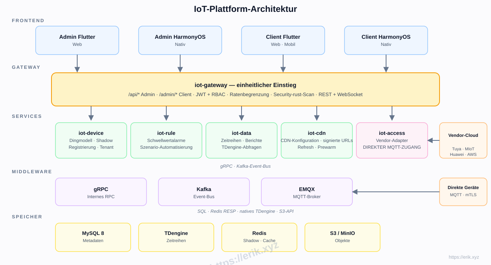
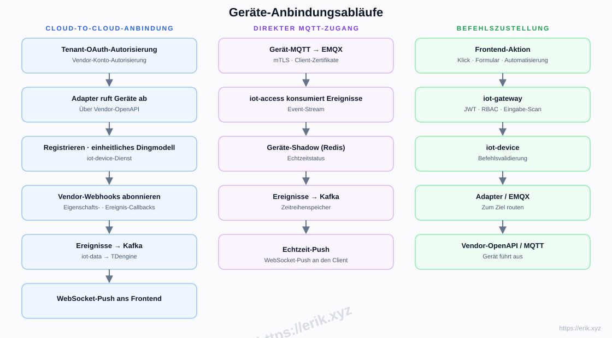
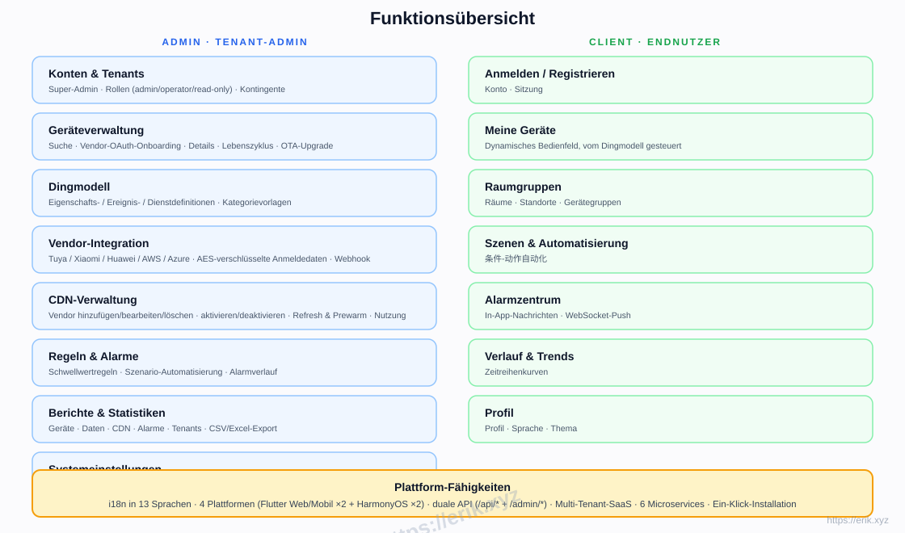
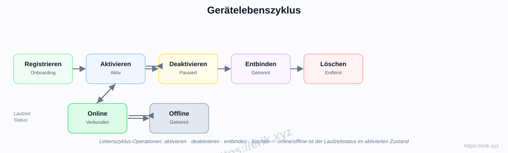
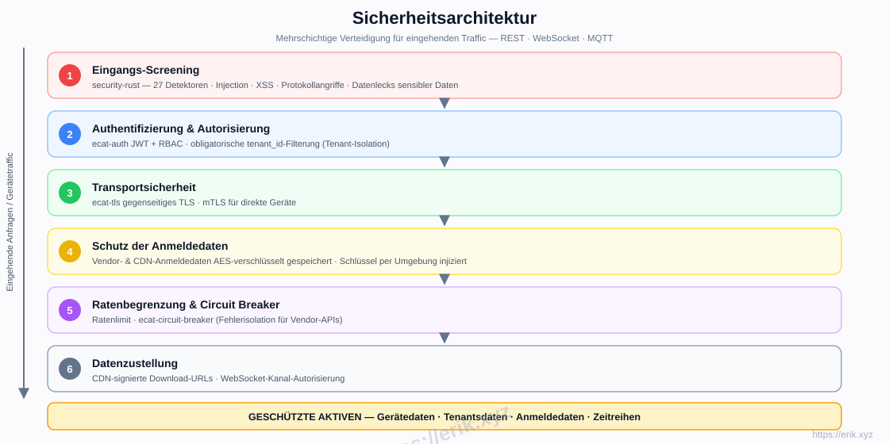

# IoT-Plattform

[中文](../../README.md) | [English](README.en.md) | [한국어](README.ko.md) | [Русский](README.ru.md) | [Deutsch](README.de.md) | [Français](README.fr.md) | [Español](README.es.md) | [Português](README.pt.md) | [हिन्दी](README.hi.md) | [العربية](README.ar.md) | [বাংলা](README.bn.md) | [Bahasa Indonesia](README.id.md) | [日本語](README.ja.md)

<p align="center">
  
</p>

Eine All-in-one-SaaS-IoT-Plattform für die einheitliche Anbindung führender Gerätehersteller im In- und Ausland (Tuya, Xiaomi, Huawei, AWS IoT, Azure IoT usw.) mit Geräteverwaltung, Dingmodell, Regeln & Alarmen, Zeitreihendaten, CDN-Auslieferung und Multiplattform-Apps. Das Backend ist ein Rust-Mikroservice-Workspace (e-cat), die Frontends sind Flutter + HarmonyOS, mit Unterstützung für 13 Sprachen.

## Funktionen

- **Multi-Vendor-Anbindung**: Cloud-to-Cloud-OAuth (Tuya / Xiaomi / Huawei / AWS / Azure) + direktes MQTT (mTLS)
- **Dingmodell**: einheitliche Modellierung von Eigenschaft / Ereignis / Dienst — im Admin modelliert, im Client dynamisch gerendert
- **Gerätelebenszyklus**: Registrieren → Aktivieren / Deaktivieren → Entbinden → Löschen, mit Online-/Offline-Status zur Laufzeit
- **Regeln & Alarme**: Schwellwertregeln, Szenario-Automatisierung, Echtzeit-Push per WebSocket
- **Daten & Berichte**: TDengine-Zeitreihenspeicher, Verlaufskurven, CSV/Excel-Export
- **CDN-Verwaltung**: Anbieterkonfiguration, Aktivieren / Deaktivieren, Refresh & Prewarm, signierte URLs
- **Multi-Tenant-SaaS**: Tenant-Isolation, Kontingente, Rollen (admin / operator / read-only)
- **Sicherheit**: Security-rust-Inbound-Scanning, JWT + RBAC, gegenseitiges TLS, AES-verschlüsselte Anmeldedaten, Ratenbegrenzung & Circuit Breaker
- **i18n in 13 Sprachen**, Flutter Web / Mobile und natives HarmonyOS (4 Apps)

## Architektur



## Geräte-Anbindungsabläufe



## Funktionsübersicht



## Gerätelebenszyklus



## Sicherheitsarchitektur



## Technologie-Stack

| Ebene | Technologie |
|----|------|
| Frontend | Flutter (Web / Mobile) · HarmonyOS ArkTS |
| Backend | Rust (axum · tokio · gRPC) · Security-rust-Scanning |
| Middleware | EMQX (MQTT) · Kafka (Event-Bus) · gRPC (internes RPC) |
| Speicher | MySQL 8 (Metadaten) · TDengine (Zeitreihen) · Redis (Shadow / Cache) · S3 / MinIO (Objekte) |
| Anbindung | Cloud-to-Cloud-OAuth-Adapter · direktes MQTT (mTLS) |

## Repository-Struktur

```
├── apps/            # Frontend-Apps
│   ├── admin/       # Admin-Konsole (Flutter + HarmonyOS)
│   └── client/      # Client-App (Flutter + HarmonyOS)
├── e-cat/           # Rust 工作区（框架 + 业务微服务一体）
│   └── ecat*/       # 框架公共库 + 业务微服务（ecat · ecat-auth · ecat-gateway · ecat-device · ecat-access · ecat-rule · ecat-data-service · ecat-data-* …）
├── ../            # Doku, Diagramme, Spendenbilder
├── scripts/         # Build- / Validierungs- / Smoke-Test-Skripte
└── docker-compose.yml  # 基础设施编排（MySQL / Redis / EMQX / Kafka / MinIO / TDengine）
```

## Ein-Klick-Installation

```bash
git clone https://github.com/erikwang2013/iot-platform.git
cd iot-platform
./scripts/install.sh
```

Das Skript erledigt automatisch: Infrastruktur starten (MySQL / Redis / EMQX / Kafka / MinIO / TDengine) → 6 Geschäftsdienste bauen → .env-Konfiguration erzeugen → Dienstliste und Startbefehle ausgeben. Wiederholtes Ausführen ist sicher.

## Installationsanleitung

### Voraussetzungen

- Docker 24+ und docker compose (oder docker-compose)
- Rust 1.80+ (stable, zum Kompilieren der Dienste; das Skript baut automatisch, wenn cargo installiert ist)
- Portprüfung: 8080-8085, 3306, 6379, 1883, 9092, 9000-9001, 6041 müssen frei sein

### Installationsschritte

1. Infrastruktur installieren und starten: `./scripts/install.sh` führt `docker compose up -d` aus
2. Dienste bauen: bei erkanntem cargo führt das Skript automatisch `cargo build --release` aus; Binärdateien landen in `scripts/bin/` (oder nutzen Sie die Artefakte unter `e-cat/target/release/`)
3. Dienste starten: starten Sie die 6 Dienste mit den am Ende des Skripts ausgegebenen Befehlen
4. Datenbank-Migration: läuft automatisch beim Dienststart; beim ersten Start legt iot-access den Standard-Mandanten und das Admin-Konto an

## Verwendung

### Anmeldung

- Admin-Konsole: melden Sie sich mit `admin / admin123` (Mandant `tenant-1`) an

### Dienstports

| Dienst | Port |
|------|------|
| iot-gateway (Gateway / öffentliche API) | 8080 |
| iot-device (Gerätedienst) | 8081 |
| iot-access (Zugang / Auth) | 8082 |
| iot-data (Datendienst) | 8083 |
| iot-rule (Regel-Engine) | 8084 |
| iot-cdn (CDN-Verwaltung) | 8085 |
| MySQL / Redis / EMQX / Kafka / MinIO / TDengine | 3306 / 6379 / 1883 / 9092 / 9000 / 6041 |

### Modulnutzung

- **Geräteverwaltung**: Gerät in der Konsole hinzufügen → Vendor-OAuth oder direkten MQTT wählen; Online-Status und Lebenszyklus in den Details prüfen
- **Dingmodell**: Attribute / Ereignisse / Dienste für Gerätekategorien definieren; das Client-Bedienfeld rendert automatisch
- **Regeln & Alarme**: Schwellwertregeln und Szenario-Automatisierung konfigurieren; Echtzeit-Push über WebSocket bei Auslösung
- **Verlaufsdaten**: iot-data speichert Zeitreihen; Verlaufskurven ansehen und als CSV / Excel exportieren
- **Berichte & Statistik**: mehrdimensionale Berichte über Geräte / Daten / CDN / Alarme / Mandanten
- **CDN-Verwaltung**: Multi-Vendor-CDN konfigurieren, Refresh / Prewarm und signierte URLs
- **Multi-Vendor-Zugang**: Cloud-zu-Cloud-OAuth-Adapter für Tuya / Xiaomi / Huawei / AWS / Azure

## Umsetzungsphasen

| Phase | Umfang |
|------|------|
| P0 Gerüst | Repo-Struktur, iot-gateway + iot-device + Docker-Orchestrierung (MySQL/Redis/EMQX/Kafka/MinIO) |
| P1 Anbindung | iot-access + Tuya-Adapter + direktes MQTT |
| P2 Daten | iot-data + TDengine + Verlaufskurven |
| P3 Regeln | iot-rule-Alarme + Szenario-Automatisierung |
| P4 Multi-Vendor + CDN | Xiaomi/Huawei/AWS/Azure-Adapter + iot-cdn |
| P5 Frontend | apps/admin + apps/client komplett |
| P6 Launch | Sicherheitshärtung, Lasttests, OTA |

## Unterstützung & Spenden

Ihre Unterstützung treibt das Projekt voran. Spenden sind herzlich willkommen — vielen Dank!

### Per QR-Code spenden (WeChat Pay / Alipay)

<p>
  
  
</p>

WeChat Pay · Alipay

### Internationale Banküberweisung

**【Empfängerinformationen】**
Empfängername: WANG KEXUN
Kontonummer: 881015918251

**【Empfängerbank】ZA Bank**
- SWIFT-Code: AABLHKHHXXX
- Bankname: ZA Bank Limited
- Bankleitzahl: 387
- Bankadresse: Core F, Cyberport 3, 100 Cyberport Road, Hong Kong

**【Korrespondenzbank für internationale Überweisungen (falls erforderlich)**】**
Bitte beachten Sie: Dies sind die Informationen der Korrespondenzbank (Zwischenbank) für internationale Überweisungen, nicht der Empfängerbank. Fragen Sie Ihre überweisende Bank, ob Korrespondenzbank-Informationen benötigt werden.

- **Für Überweisungen in HKD, CNY und USD ist die Korrespondenzbank Citibank**
- Bankname: Citibank N.A. Hong Kong
- SWIFT-Code: CITIHKHXXXX
- Bankleitzahl: 006
- Filialname: Hong Kong Branch
- Filialnummer: 391
- Bankadresse: Citibank Tower, Citibank Plaza, 3 Garden Road, Central, Hong Kong

- **Für Überweisungen in anderen Währungen ist die Korrespondenzbank BNY Mellon**
- Bankname: THE BANK OF NEW YORK MELLON
- SWIFT-Code: IRVTUS3NXXX
- Bankadresse: THE BANK OF NEW YORK MELLON, 240 GREENWICH STREET, NEW YORK, United States

### Krypto-Spenden

| Coin | Network | Wallet Address |
|------|---------|----------------|
| [](../coin/1.jpg) | BNB Smart Chain (BEP20) | `0x355d429f97511897ccb4e271ec888205f9ab6629` |
| [](../coin/2.jpg) | Tron (TRC20) | `TEdDHWLajt1XvqtPDWmQctdrJaC3pzZZzz` |
| [](../coin/3.jpg) | Ethereum (ERC20) | `0x355d429f97511897ccb4e271ec888205f9ab6629` |
| [](../coin/4.jpg) | Aptos | `0x836e3780edfc3f7b2372b39e2a1a3a5d7adfaccd96c726f21cfde1b50dd68030` |
| [](../coin/5.jpg) | Plasma | `0x355d429f97511897ccb4e271ec888205f9ab6629` |
| [](../coin/6.jpg) | Polygon POS | `0x355d429f97511897ccb4e271ec888205f9ab6629` |
| [](../coin/7.jpg) | Solana | `2hfhboHdmdrYsY25XfQSsEWxq5ip4EQsR7f4AzSRMUyr` |
| [](../coin/8.jpg) | The Open Network (TON) | `UQB9kFQohzmXUir9QSSZq01iwl9aQZIDdBpNmDklljRtCoGK` |
| [](../coin/9.jpg) | Arbitrum One | `0x355d429f97511897ccb4e271ec888205f9ab6629` |
| [](../coin/10.jpg) | AVAX C-Chain | `0x355d429f97511897ccb4e271ec888205f9ab6629` |

## Lizenz

Der Code dieses Projekts dient ausschließlich zu Lern- und Austauschzwecken.
