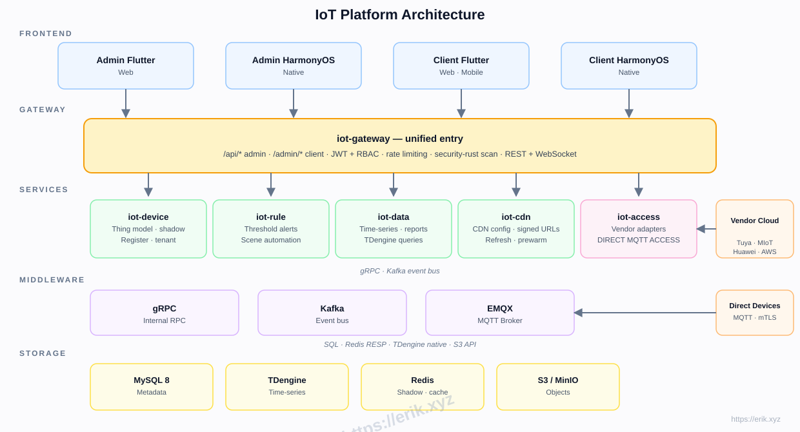
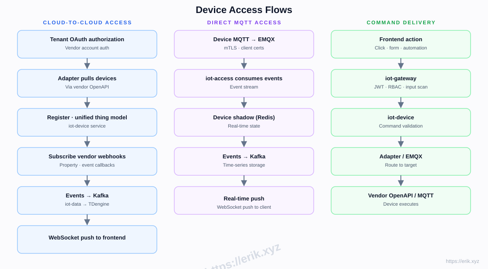
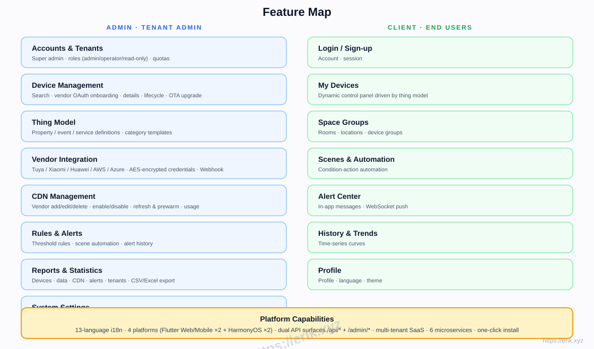
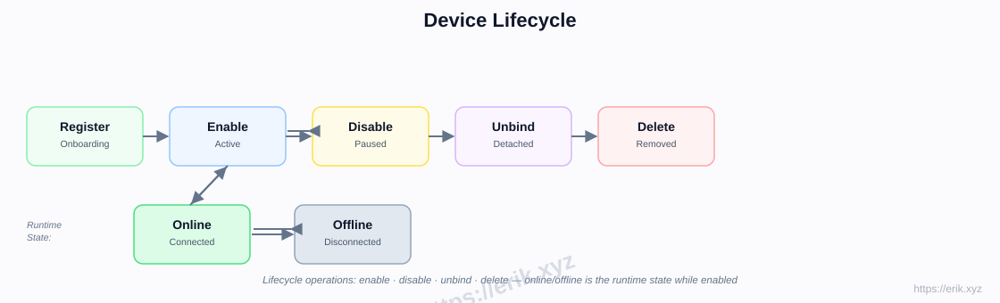
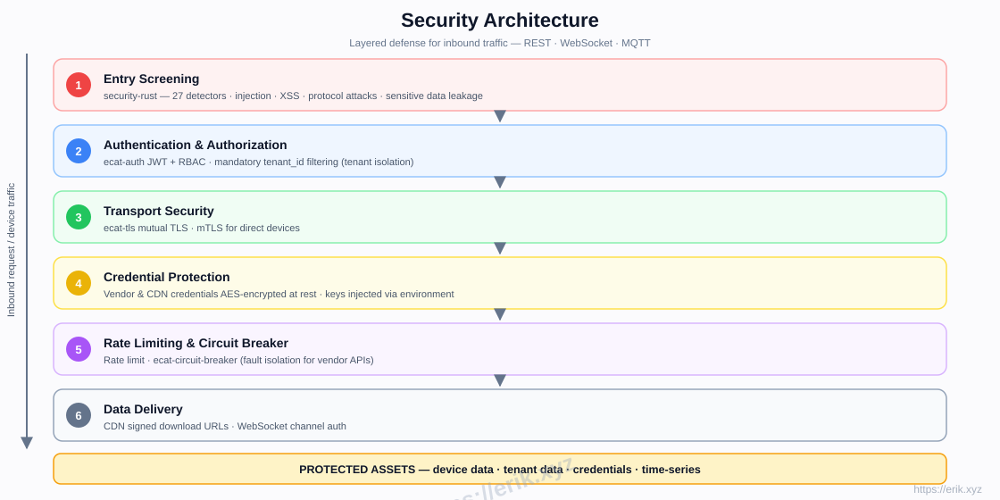

# IoT Platform

[中文](../../README.md) | [English](README.en.md) | [한국어](README.ko.md) | [Русский](README.ru.md) | [Deutsch](README.de.md) | [Français](README.fr.md) | [Español](README.es.md) | [Português](README.pt.md) | [हिन्दी](README.hi.md) | [العربية](README.ar.md) | [বাংলা](README.bn.md) | [Bahasa Indonesia](README.id.md) | [日本語](README.ja.md)

<p align="center">
  
</p>

A one-stop SaaS IoT platform that unifies access to major device vendors at home and abroad (Tuya, Xiaomi, Huawei, AWS IoT, Azure IoT, etc.), providing device management, thing models, rules & alerts, time-series data, CDN delivery, and multi-platform apps. The backend is a Rust microservice workspace (e-cat), the frontends are Flutter + HarmonyOS, with support for 13 languages.

## Features

- **Multi-vendor access**: cloud-to-cloud OAuth (Tuya / Xiaomi / Huawei / AWS / Azure) + direct MQTT (mTLS)
- **Thing model**: unified modeling of property / event / service — modeled in admin, rendered dynamically in client
- **Device lifecycle**: register → enable / disable → unbind → delete, with online / offline runtime status
- **Rules & alerts**: threshold rules, scene automation, real-time WebSocket push
- **Data & reports**: TDengine time-series storage, history curves, CSV/Excel export
- **CDN management**: vendor config, enable/disable, refresh & prewarm, signed URLs
- **Multi-tenant SaaS**: tenant isolation, quotas, roles (admin / operator / read-only)
- **Security**: security-rust inbound scanning, JWT + RBAC, mutual TLS, AES-encrypted credentials, rate limiting & circuit breaker
- **13-language i18n**, across Flutter Web / Mobile and native HarmonyOS (4 apps)

## Architecture



## Device Access Flows



## Feature Map



## Device Lifecycle



## Security Architecture



## Tech Stack

| Layer | Technology |
|----|------|
| Frontend | Flutter (Web / Mobile) · HarmonyOS ArkTS |
| Backend | Rust (axum · tokio · gRPC) · security-rust scanning |
| Middleware | EMQX (MQTT) · Kafka (event bus) · gRPC (internal RPC) |
| Storage | MySQL 8 (metadata) · TDengine (time-series) · Redis (shadow / cache) · S3 / MinIO (objects) |
| Access | Cloud-to-cloud OAuth adapters · direct MQTT (mTLS) |

## Repository Layout

```
├── apps/            # Frontend apps
│   ├── admin/       # Admin console (Flutter + HarmonyOS)
│   └── client/      # Client app (Flutter + HarmonyOS)
├── e-cat/           # Rust workspace (microservices + shared crates)
│   └── services/    # iot-gateway · iot-device · iot-access · iot-rule · iot-data · iot-cdn
├── ../            # Docs, diagrams, donation images
├── scripts/         # Build / validation / smoke-test scripts
└── docker-compose.yml  # Infrastructure (MySQL / Redis / EMQX / Kafka / MinIO)
```

## Implementation Phases

| Phase | Scope |
|------|------|
| P0 Skeleton | Repo structure, iot-gateway + iot-device + Docker orchestration (MySQL/Redis/EMQX/Kafka/MinIO) |
| P1 Access | iot-access + Tuya adapter + direct MQTT |
| P2 Data | iot-data + TDengine + history curves |
| P3 Rules | iot-rule alerts + scene automation |
| P4 Multi-vendor + CDN | Xiaomi/Huawei/AWS/Azure adapters + iot-cdn |
| P5 Frontend | apps/admin + apps/client full-stack |
| P6 Launch | Security hardening, load testing, OTA |

## Support & Donations

Your support keeps this project going. Donations are greatly appreciated!

### Scan to Donate (WeChat Pay / Alipay)

<p>
  
  
</p>

WeChat Pay · Alipay

### Global Bank Transfer

**【Payee Information】**
Payee Name: WANG KEXUN
Account Number: 881015918251

**【Receiving Bank】ZA Bank**
- SWIFT Code: AABLHKHHXXX
- Bank Name: ZA Bank Limited
- Bank Code: 387
- Bank Address: Core F, Cyberport 3, 100 Cyberport Road, Hong Kong

**【Correspondent Bank for Cross-Border Remittance (if required)】**
Please note that this is the correspondent (intermediary) bank information for cross-border remittance, not the receiving bank. Please check with your remitting bank whether correspondent bank information is required.

- **For remittances in HKD, CNY and USD, the correspondent bank is Citibank**
- Bank Name: Citibank N.A. Hong Kong
- SWIFT Code: CITIHKHXXXX
- Bank Code: 006
- Branch Name: Hong Kong Branch
- Branch Code: 391
- Bank Address: Citibank Tower, Citibank Plaza, 3 Garden Road, Central, Hong Kong

- **For remittances in other currencies, the correspondent bank is BNY Mellon**
- Bank Name: THE BANK OF NEW YORK MELLON
- SWIFT Code: IRVTUS3NXXX
- Bank Address: THE BANK OF NEW YORK MELLON, 240 GREENWICH STREET, NEW YORK, United States

### Crypto Donations

| Coin | Network | Wallet Address |
|------|---------|----------------|
| [](../coin/1.jpg) | BNB Smart Chain (BEP20) | `0x355d429f97511897ccb4e271ec888205f9ab6629` |
| [](../coin/2.jpg) | Tron (TRC20) | `TEdDHWLajt1XvqtPDWmQctdrJaC3pzZZzz` |
| [](../coin/3.jpg) | Ethereum (ERC20) | `0x355d429f97511897ccb4e271ec888205f9ab6629` |
| [](../coin/4.jpg) | Aptos | `0x836e3780edfc3f7b2372b39e2a1a3a5d7adfaccd96c726f21cfde1b50dd68030` |
| [](../coin/5.jpg) | Plasma | `0x355d429f97511897ccb4e271ec888205f9ab6629` |
| [](../coin/6.jpg) | Polygon POS | `0x355d429f97511897ccb4e271ec888205f9ab6629` |
| [](../coin/7.jpg) | Solana | `2hfhboHdmdrYsY25XfQSsEWxq5ip4EQsR7f4AzSRMUyr` |
| [](../coin/8.jpg) | The Open Network (TON) | `UQB9kFQohzmXUir9QSSZq01iwl9aQZIDdBpNmDklljRtCoGK` |
| [](../coin/9.jpg) | Arbitrum One | `0x355d429f97511897ccb4e271ec888205f9ab6629` |
| [](../coin/10.jpg) | AVAX C-Chain | `0x355d429f97511897ccb4e271ec888205f9ab6629` |

## License

This project's code is provided for learning and communication purposes only.
