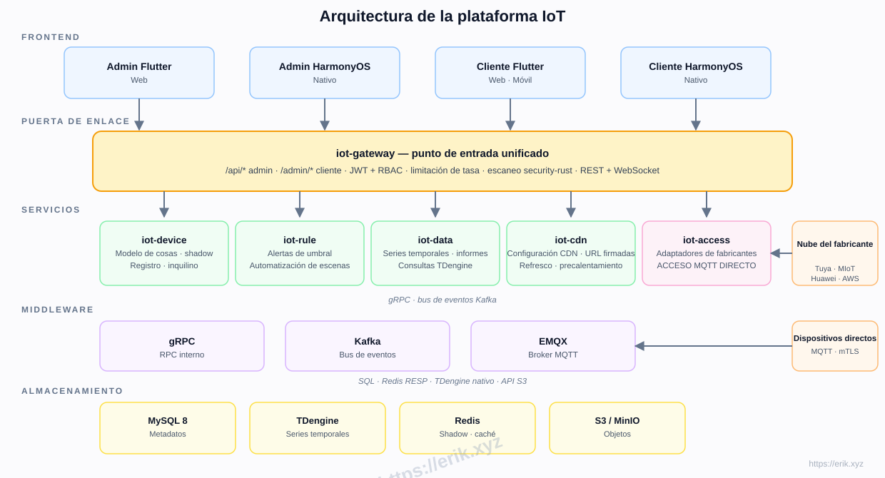
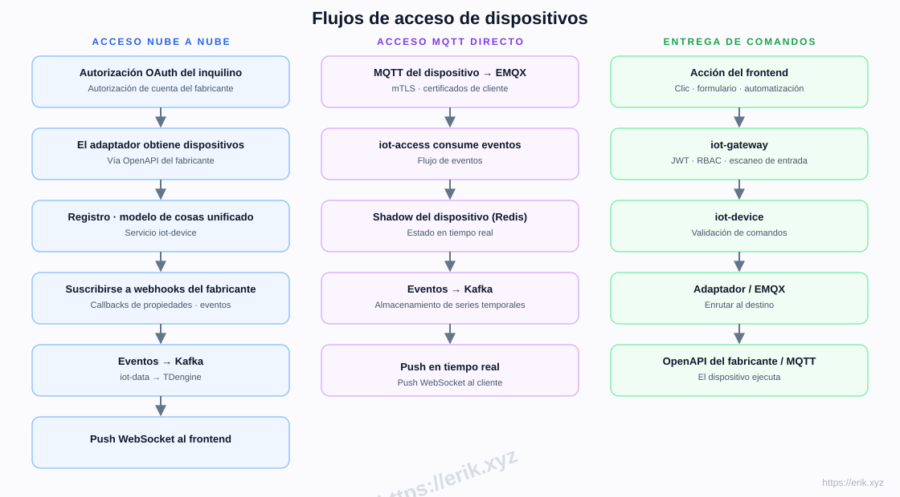
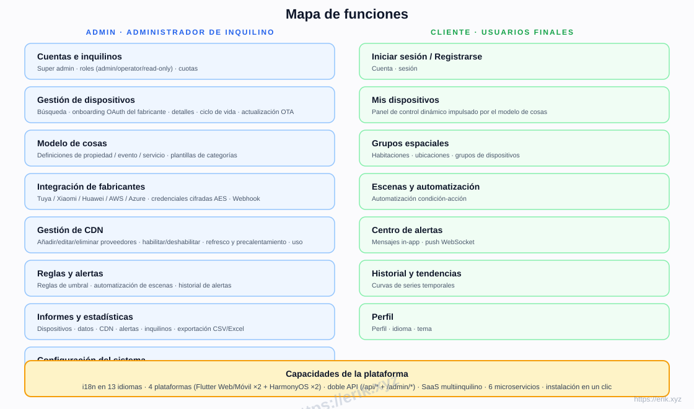
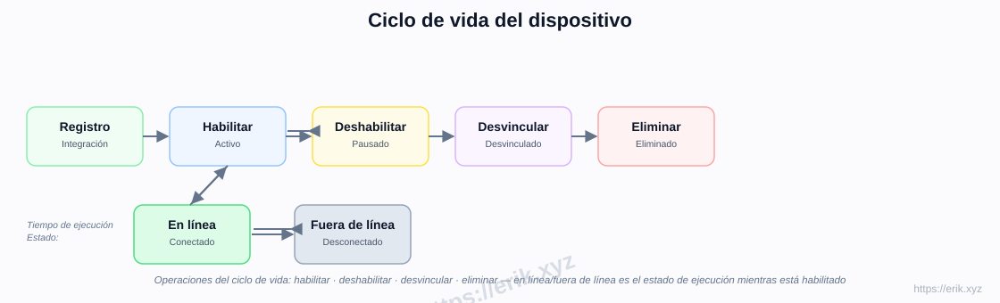
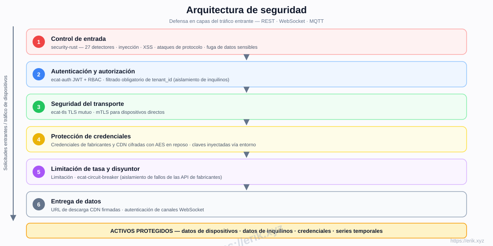

# Plataforma IoT

[中文](../../README.md) | [English](README.en.md) | [한국어](README.ko.md) | [Русский](README.ru.md) | [Deutsch](README.de.md) | [Français](README.fr.md) | [Español](README.es.md) | [Português](README.pt.md) | [हिन्दी](README.hi.md) | [العربية](README.ar.md) | [বাংলা](README.bn.md) | [Bahasa Indonesia](README.id.md) | [日本語](README.ja.md)

<p align="center">
  
</p>

Una plataforma SaaS de IoT todo en uno que unifica el acceso a los principales fabricantes de dispositivos nacionales e internacionales (Tuya, Xiaomi, Huawei, AWS IoT, Azure IoT, etc.), ofreciendo gestión de dispositivos, modelos de cosas, reglas y alertas, datos de series temporales, entrega CDN y aplicaciones multiplataforma. El backend es un workspace de microservicios Rust (e-cat), los frontends son Flutter + HarmonyOS, con soporte para 13 idiomas.

## Características

- **Acceso multi-fabricante**: OAuth nube a nube (Tuya / Xiaomi / Huawei / AWS / Azure) + MQTT directo (mTLS)
- **Modelo de cosas**: modelado unificado de propiedad / evento / servicio — modelado en el admin, renderizado dinámicamente en el cliente
- **Ciclo de vida del dispositivo**: registro → habilitar / deshabilitar → desvincular → eliminar, con estado en línea / fuera de línea en tiempo de ejecución
- **Reglas y alertas**: reglas de umbral, automatización de escenas, push WebSocket en tiempo real
- **Datos e informes**: almacenamiento de series temporales TDengine, curvas históricas, exportación CSV/Excel
- **Gestión de CDN**: configuración de proveedores, habilitar / deshabilitar, refresco y precalentamiento, URL firmadas
- **SaaS multi-tenant**: aislamiento de inquilinos, cuotas, roles (admin / operator / read-only)
- **Seguridad**: escaneo entrante security-rust, JWT + RBAC, TLS mutuo, credenciales cifradas con AES, limitación de tasa y disyuntor
- **i18n en 13 idiomas**, Flutter Web / Mobile y HarmonyOS nativo (4 aplicaciones)

## Arquitectura



## Flujos de acceso de dispositivos



## Mapa de funciones



## Ciclo de vida del dispositivo



## Arquitectura de seguridad



## Pila tecnológica

| Capa | Tecnología |
|----|------|
| Frontend | Flutter (Web / Mobile) · HarmonyOS ArkTS |
| Backend | Rust (axum · tokio · gRPC) · escaneo security-rust |
| Middleware | EMQX (MQTT) · Kafka (bus de eventos) · gRPC (RPC interno) |
| Almacenamiento | MySQL 8 (metadatos) · TDengine (series temporales) · Redis (shadow / caché) · S3 / MinIO (objetos) |
| Acceso | Adaptadores OAuth nube a nube · MQTT directo (mTLS) |

## Estructura del repositorio

```
├── apps/            # Aplicaciones frontend
│   ├── admin/       # Consola de administración (Flutter + HarmonyOS)
│   └── client/      # Aplicación cliente (Flutter + HarmonyOS)
├── e-cat/           # Workspace Rust (microservicios + crates compartidos)
│   └── services/    # iot-gateway · iot-device · iot-access · iot-rule · iot-data · iot-cdn
├── ../            # Documentación, diagramas, imágenes de donaciones
├── scripts/         # Scripts de build / validación / smoke tests
└── docker-compose.yml  # Infraestructura (MySQL / Redis / EMQX / Kafka / MinIO)
```

## Fases de implementación

| Fase | Alcance |
|------|------|
| P0 Esqueleto | Estructura del repo, iot-gateway + iot-device + orquestación Docker (MySQL/Redis/EMQX/Kafka/MinIO) |
| P1 Acceso | iot-access + adaptador Tuya + MQTT directo |
| P2 Datos | iot-data + TDengine + curvas históricas |
| P3 Reglas | alertas iot-rule + automatización de escenas |
| P4 Multi-fabricante + CDN | Adaptadores Xiaomi/Huawei/AWS/Azure + iot-cdn |
| P5 Frontend | apps/admin + apps/client completos |
| P6 Lanzamiento | Endurecimiento de seguridad, pruebas de carga, OTA |

## Soporte y donaciones

Su apoyo impulsa el proyecto. ¡Las donaciones son bienvenidas, muchísimas gracias!

### Donar escaneando el código QR (WeChat Pay / Alipay)

<p>
  
  
</p>

WeChat Pay · Alipay

### Transferencia bancaria internacional

**【Información del beneficiario】**
Nombre del beneficiario: WANG KEXUN
Número de cuenta: 881015918251

**【Banco del beneficiario】ZA Bank**
- Código SWIFT: AABLHKHHXXX
- Nombre del banco: ZA Bank Limited
- Código bancario: 387
- Dirección del banco: Core F, Cyberport 3, 100 Cyberport Road, Hong Kong

**【Banco corresponsal para transferencias internacionales (si es necesario)**】**
Tenga en cuenta que esta es la información del banco corresponsal (intermediario) para transferencias internacionales, no del banco del beneficiario. Consulte con su banco emisor si se requiere información del banco corresponsal.

- **Para transferencias en HKD, CNY y USD, el banco corresponsal es Citibank**
- Nombre del banco: Citibank N.A. Hong Kong
- Código SWIFT: CITIHKHXXXX
- Código bancario: 006
- Nombre de la sucursal: Hong Kong Branch
- Código de sucursal: 391
- Dirección del banco: Citibank Tower, Citibank Plaza, 3 Garden Road, Central, Hong Kong

- **Para transferencias en otras monedas, el banco corresponsal es BNY Mellon**
- Nombre del banco: THE BANK OF NEW YORK MELLON
- Código SWIFT: IRVTUS3NXXX
- Dirección del banco: THE BANK OF NEW YORK MELLON, 240 GREENWICH STREET, NEW YORK, United States

### Donaciones en criptomonedas

| Coin | Network | Wallet Address |
|------|---------|----------------|
| [](../coin/1.jpg) | BNB Smart Chain (BEP20) | `0x355d429f97511897ccb4e271ec888205f9ab6629` |
| [](../coin/2.jpg) | Tron (TRC20) | `TEdDHWLajt1XvqtPDWmQctdrJaC3pzZZzz` |
| [](../coin/3.jpg) | Ethereum (ERC20) | `0x355d429f97511897ccb4e271ec888205f9ab6629` |
| [](../coin/4.jpg) | Aptos | `0x836e3780edfc3f7b2372b39e2a1a3a5d7adfaccd96c726f21cfde1b50dd68030` |
| [](../coin/5.jpg) | Plasma | `0x355d429f97511897ccb4e271ec888205f9ab6629` |
| [](../coin/6.jpg) | Polygon POS | `0x355d429f97511897ccb4e271ec888205f9ab6629` |
| [](../coin/7.jpg) | Solana | `2hfhboHdmdrYsY25XfQSsEWxq5ip4EQsR7f4AzSRMUyr` |
| [](../coin/8.jpg) | The Open Network (TON) | `UQB9kFQohzmXUir9QSSZq01iwl9aQZIDdBpNmDklljRtCoGK` |
| [](../coin/9.jpg) | Arbitrum One | `0x355d429f97511897ccb4e271ec888205f9ab6629` |
| [](../coin/10.jpg) | AVAX C-Chain | `0x355d429f97511897ccb4e271ec888205f9ab6629` |

## Licencia

El código de este proyecto se proporciona únicamente con fines de aprendizaje e intercambio.
