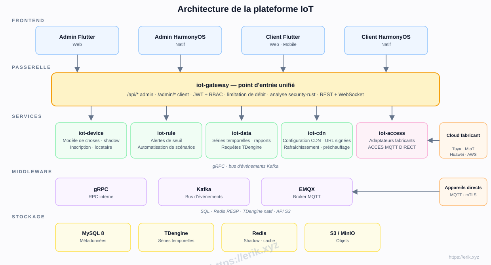
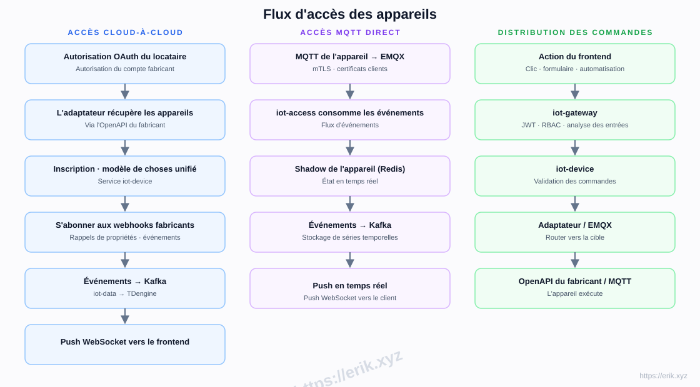
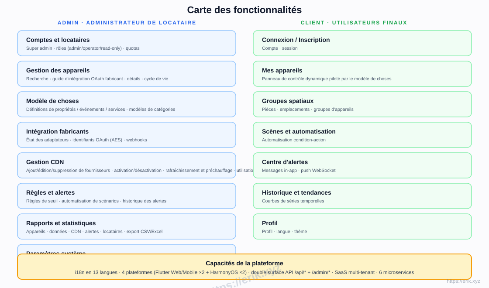
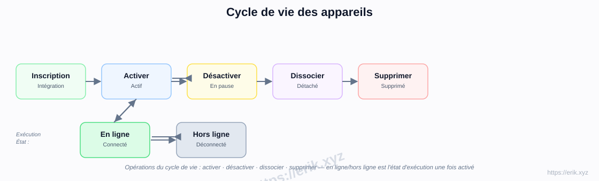
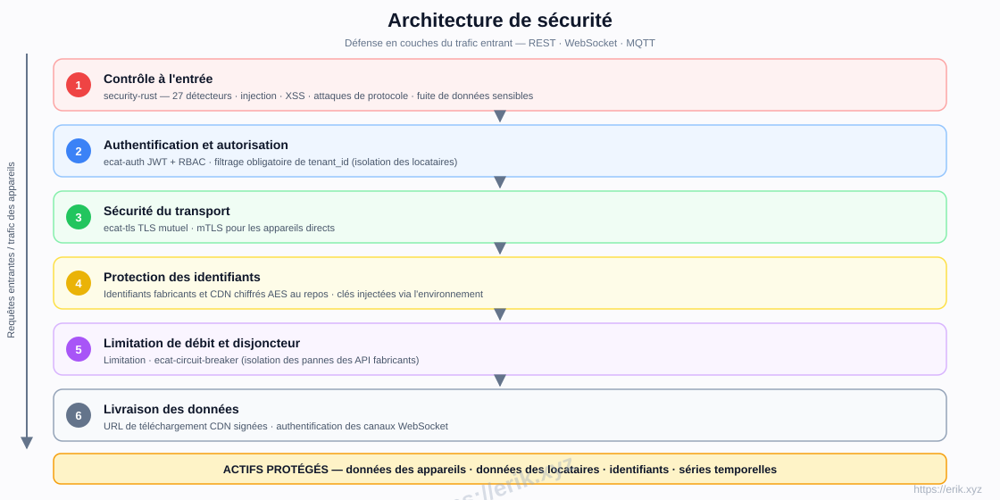

# Plateforme IoT

[中文](../../README.md) | [English](README.en.md) | [한국어](README.ko.md) | [Русский](README.ru.md) | [Deutsch](README.de.md) | [Français](README.fr.md) | [Español](README.es.md) | [Português](README.pt.md) | [हिन्दी](README.hi.md) | [العربية](README.ar.md) | [বাংলা](README.bn.md) | [Bahasa Indonesia](README.id.md) | [日本語](README.ja.md)

<p align="center">
  
</p>

Une plateforme SaaS IoT tout-en-un qui unifie l'accès aux grands fabricants d'appareils nationaux et internationaux (Tuya, Xiaomi, Huawei, AWS IoT, Azure IoT, etc.), offrant gestion des appareils, modèles de choses, règles et alertes, données de séries temporelles, diffusion CDN et applications multiplateformes. Le backend est un workspace de microservices Rust (e-cat), les frontends sont Flutter + HarmonyOS, avec prise en charge de 13 langues.

## Fonctionnalités

- **Accès multi-fabricants** : OAuth cloud-à-cloud (Tuya / Xiaomi / Huawei / AWS / Azure) + MQTT direct (mTLS)
- **Modèle de choses** : modélisation unifiée des propriétés / événements / services — modélisé dans l'admin, rendu dynamiquement dans le client
- **Cycle de vie des appareils** : inscription → activation / désactivation → dissociation → suppression, avec statut en ligne / hors ligne à l'exécution
- **Règles et alertes** : règles de seuil, automatisation de scénarios, push WebSocket en temps réel
- **Données et rapports** : stockage de séries temporelles TDengine, courbes d'historique, export CSV/Excel
- **Gestion CDN** : configuration des fournisseurs, activation / désactivation, rafraîchissement et préchauffage, URL signées
- **SaaS multi-tenant** : isolation des locataires, quotas, rôles (admin / operator / read-only)
- **Sécurité** : analyse entrante security-rust, JWT + RBAC, TLS mutuel, identifiants chiffrés AES, limitation de débit et disjoncteur
- **i18n en 13 langues**, Flutter Web / Mobile et HarmonyOS natif (4 applications)

## Architecture



## Flux d'accès des appareils



## Carte des fonctionnalités



## Cycle de vie des appareils



## Architecture de sécurité



## Pile technologique

| Couche | Technologie |
|----|------|
| Frontend | Flutter (Web / Mobile) · HarmonyOS ArkTS |
| Backend | Rust (axum · tokio · gRPC) · analyse security-rust |
| Middleware | EMQX (MQTT) · Kafka (bus d'événements) · gRPC (RPC interne) |
| Stockage | MySQL 8 (métadonnées) · TDengine (séries temporelles) · Redis (shadow / cache) · S3 / MinIO (objets) |
| Accès | Adaptateurs OAuth cloud-à-cloud · MQTT direct (mTLS) |

## Structure du dépôt

```
├── apps/            # Applications frontend
│   ├── admin/       # Console d'administration (Flutter + HarmonyOS)
│   └── client/      # Application client (Flutter + HarmonyOS)
├── e-cat/           # Workspace Rust (microservices + crates partagés)
│   └── services/    # iot-gateway · iot-device · iot-access · iot-rule · iot-data · iot-cdn
├── ../            # Docs, diagrammes, images de dons
├── scripts/         # Scripts de build / validation / smoke tests
└── docker-compose.yml  # Infrastructure (MySQL / Redis / EMQX / Kafka / MinIO)
```

## Phases de mise en œuvre

| Phase | Périmètre |
|------|------|
| P0 Squelette | Structure du dépôt, iot-gateway + iot-device + orchestration Docker (MySQL/Redis/EMQX/Kafka/MinIO) |
| P1 Accès | iot-access + adaptateur Tuya + MQTT direct |
| P2 Données | iot-data + TDengine + courbes d'historique |
| P3 Règles | alertes iot-rule + automatisation de scénarios |
| P4 Multi-fabricants + CDN | Adaptateurs Xiaomi/Huawei/AWS/Azure + iot-cdn |
| P5 Frontend | apps/admin + apps/client complets |
| P6 Lancement | Durcissement de la sécurité, tests de charge, OTA |

## Soutien et dons

Votre soutien fait avancer le projet. Les dons sont les bienvenus, merci infiniment !

### Donner par QR code (WeChat Pay / Alipay)

<p>
  
  
</p>

WeChat Pay · Alipay

### Virement bancaire international

**【Informations sur le bénéficiaire】**
Nom du bénéficiaire : WANG KEXUN
Numéro de compte : 881015918251

**【Banque du bénéficiaire】ZA Bank**
- Code SWIFT : AABLHKHHXXX
- Nom de la banque : ZA Bank Limited
- Code banque : 387
- Adresse de la banque : Core F, Cyberport 3, 100 Cyberport Road, Hong Kong

**【Banque correspondante pour virements internationaux (si nécessaire)**】**
Veuillez noter qu'il s'agit des informations de la banque correspondante (intermédiaire) pour les virements internationaux, et non de la banque du bénéficiaire. Renseignez-vous auprès de votre banque émettrice pour savoir si les informations de la banque correspondante sont requises.

- **Pour les virements en HKD, CNY et USD, la banque correspondante est Citibank**
- Nom de la banque : Citibank N.A. Hong Kong
- Code SWIFT : CITIHKHXXXX
- Code banque : 006
- Nom de la succursale : Hong Kong Branch
- Code succursale : 391
- Adresse de la banque : Citibank Tower, Citibank Plaza, 3 Garden Road, Central, Hong Kong

- **Pour les virements dans d'autres devises, la banque correspondante est BNY Mellon**
- Nom de la banque : THE BANK OF NEW YORK MELLON
- Code SWIFT : IRVTUS3NXXX
- Adresse de la banque : THE BANK OF NEW YORK MELLON, 240 GREENWICH STREET, NEW YORK, United States

### Dons en cryptomonnaie

| Coin | Network | Wallet Address |
|------|---------|----------------|
| [](../coin/1.jpg) | BNB Smart Chain (BEP20) | `0x355d429f97511897ccb4e271ec888205f9ab6629` |
| [](../coin/2.jpg) | Tron (TRC20) | `TEdDHWLajt1XvqtPDWmQctdrJaC3pzZZzz` |
| [](../coin/3.jpg) | Ethereum (ERC20) | `0x355d429f97511897ccb4e271ec888205f9ab6629` |
| [](../coin/4.jpg) | Aptos | `0x836e3780edfc3f7b2372b39e2a1a3a5d7adfaccd96c726f21cfde1b50dd68030` |
| [](../coin/5.jpg) | Plasma | `0x355d429f97511897ccb4e271ec888205f9ab6629` |
| [](../coin/6.jpg) | Polygon POS | `0x355d429f97511897ccb4e271ec888205f9ab6629` |
| [](../coin/7.jpg) | Solana | `2hfhboHdmdrYsY25XfQSsEWxq5ip4EQsR7f4AzSRMUyr` |
| [](../coin/8.jpg) | The Open Network (TON) | `UQB9kFQohzmXUir9QSSZq01iwl9aQZIDdBpNmDklljRtCoGK` |
| [](../coin/9.jpg) | Arbitrum One | `0x355d429f97511897ccb4e271ec888205f9ab6629` |
| [](../coin/10.jpg) | AVAX C-Chain | `0x355d429f97511897ccb4e271ec888205f9ab6629` |

## Licence

Le code de ce projet est fourni uniquement à des fins d'apprentissage et d'échange.
