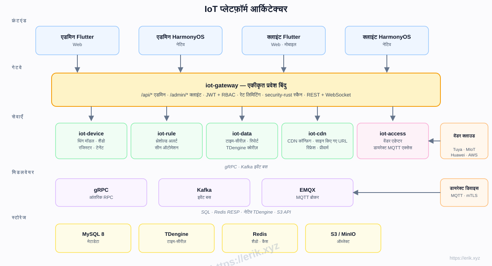
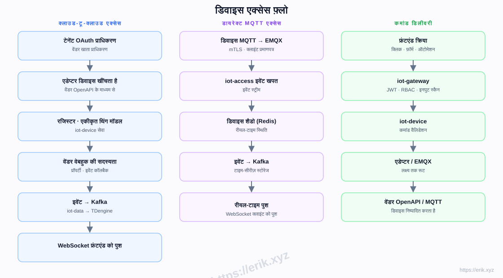
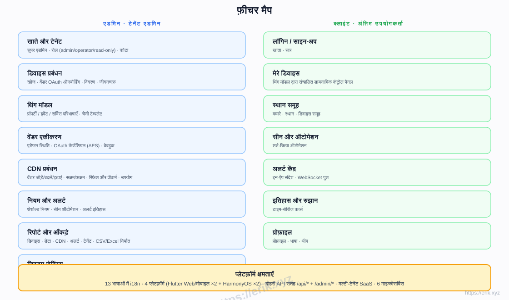
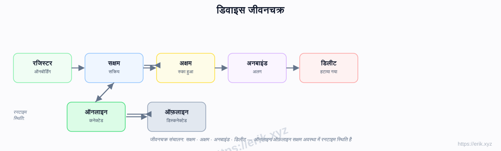
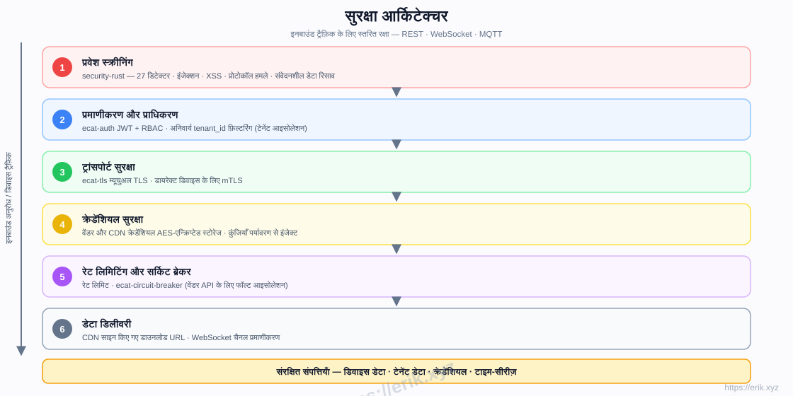

# IoT प्लेटफ़ॉर्म

[中文](../../README.md) | [English](README.en.md) | [한국어](README.ko.md) | [Русский](README.ru.md) | [Deutsch](README.de.md) | [Français](README.fr.md) | [Español](README.es.md) | [Português](README.pt.md) | [हिन्दी](README.hi.md) | [العربية](README.ar.md) | [বাংলা](README.bn.md) | [Bahasa Indonesia](README.id.md) | [日本語](README.ja.md)

<p align="center">
  
</p>

एक ऑल-इन-वन SaaS IoT प्लेटफ़ॉर्म जो घरेलू और विदेशी प्रमुख डिवाइस निर्माताओं (Tuya, Xiaomi, Huawei, AWS IoT, Azure IoT आदि) तक एकीकृत पहुंच प्रदान करता है, जिसमें डिवाइस प्रबंधन, थिंग मॉडल, नियम और अलर्ट, टाइम-सीरीज़ डेटा, CDN डिलीवरी और मल्टी-प्लेटफ़ॉर्म ऐप्स शामिल हैं। बैकएंड Rust माइक्रोसर्विस वर्कस्पेस (e-cat) है, फ्रंटएंड Flutter + HarmonyOS हैं, 13 भाषाओं के समर्थन के साथ।

## विशेषताएँ

- **मल्टी-वेंडर एक्सेस**: क्लाउड-टू-क्लाउड OAuth (Tuya / Xiaomi / Huawei / AWS / Azure) + डायरेक्ट MQTT (mTLS)
- **थिंग मॉडल**: प्रॉपर्टी / इवेंट / सर्विस का एकीकृत मॉडलिंग — एडमिन में मॉडलिंग, क्लाइंट में डायनामिक रेंडरिंग
- **डिवाइस जीवनचक्र**: रजिस्टर → सक्षम / अक्षम → अनबाइंड → डिलीट, रनटाइम पर ऑनलाइन / ऑफ़लाइन स्थिति
- **नियम और अलर्ट**: थ्रेशोल्ड नियम, सीन ऑटोमेशन, WebSocket रीयल-टाइम पुश
- **डेटा और रिपोर्ट**: TDengine टाइम-सीरीज़ स्टोरेज, हिस्ट्री कर्व्स, CSV/Excel निर्यात
- **CDN प्रबंधन**: वेंडर कॉन्फ़िग, सक्षम / अक्षम, रिफ्रेश और प्रीवार्म, साइन किए गए URL
- **मल्टी-टेनेंट SaaS**: टेनेंट आइसोलेशन, कोटा, रोल (admin / operator / read-only)
- **सुरक्षा**: security-rust इनबाउंड स्कैनिंग, JWT + RBAC, म्यूचुअल TLS, AES-एन्क्रिप्टेड क्रेडेंशियल, रेट लिमिटिंग और सर्किट ब्रेकर
- **13 भाषाओं में i18n**, Flutter Web / Mobile और नेटिव HarmonyOS (4 ऐप्स)

## आर्किटेक्चर



## डिवाइस एक्सेस फ़्लो



## फ़ीचर मैप



## डिवाइस जीवनचक्र



## सुरक्षा आर्किटेक्चर



## टेक स्टैक

| परत | तकनीक |
|----|------|
| फ्रंटएंड | Flutter (Web / Mobile) · HarmonyOS ArkTS |
| बैकएंड | Rust (axum · tokio · gRPC) · security-rust स्कैनिंग |
| मिडलवेयर | EMQX (MQTT) · Kafka (इवेंट बस) · gRPC (आंतरिक RPC) |
| स्टोरेज | MySQL 8 (मेटाडेटा) · TDengine (टाइम-सीरीज़) · Redis (शैडो / कैश) · S3 / MinIO (ऑब्जेक्ट) |
| एक्सेस | क्लाउड-टू-क्लाउड OAuth एडेप्टर · डायरेक्ट MQTT (mTLS) |

## रिपॉज़िटरी संरचना

```
├── apps/            # फ्रंटएंड ऐप्स
│   ├── admin/       # एडमिन कंसोल (Flutter + HarmonyOS)
│   └── client/      # क्लाइंट ऐप (Flutter + HarmonyOS)
├── e-cat/           # Rust वर्कस्पेस (माइक्रोसर्विसेज़ + साझा क्रेट्स)
│   └── services/    # iot-gateway · iot-device · iot-access · iot-rule · iot-data · iot-cdn
├── ../            # दस्तावेज़, डायग्राम, दान छवियाँ
├── scripts/         # बिल्ड / वैलिडेशन / स्मोक-टेस्ट स्क्रिप्ट्स
└── docker-compose.yml  # इंफ्रास्ट्रक्चर (MySQL / Redis / EMQX / Kafka / MinIO)
```

## कार्यान्वयन चरण

| चरण | दायरा |
|------|------|
| P0 स्केलेटन | रिपोज़िटरी संरचना, iot-gateway + iot-device + Docker ऑर्केस्ट्रेशन (MySQL/Redis/EMQX/Kafka/MinIO) |
| P1 एक्सेस | iot-access + Tuya एडेप्टर + डायरेक्ट MQTT |
| P2 डेटा | iot-data + TDengine + हिस्ट्री कर्व्स |
| P3 नियम | iot-rule अलर्ट + सीन ऑटोमेशन |
| P4 मल्टी-वेंडर + CDN | Xiaomi/Huawei/AWS/Azure एडेप्टर + iot-cdn |
| P5 फ्रंटएंड | apps/admin + apps/client पूर्ण |
| P6 लॉन्च | सुरक्षा सख्तीकरण, लोड टेस्टिंग, OTA |

## समर्थन और दान

आपका समर्थन ही परियोजना की निरंतर प्रगति का आधार है। दान का स्वागत है, बहुत-बहुत धन्यवाद!

### QR कोड स्कैन कर दान करें (WeChat Pay / Alipay)

<p>
  
  
</p>

WeChat Pay · Alipay

### अंतर्राष्ट्रीय बैंक ट्रांसफर

**【प्राप्तकर्ता जानकारी】**
प्राप्तकर्ता का नाम: WANG KEXUN
खाता संख्या: 881015918251

**【प्राप्तकर्ता बैंक】ZA Bank**
- SWIFT कोड: AABLHKHHXXX
- बैंक का नाम: ZA Bank Limited
- बैंक कोड: 387
- बैंक का पता: Core F, Cyberport 3, 100 Cyberport Road, Hong Kong

**【क्रॉस-बॉर्डर रेमिटेंस के लिए संवाददाता बैंक (यदि आवश्यक हो)**】**
कृपया ध्यान दें: यह अंतर्राष्ट्रीय रेमिटेंस के लिए संवाददाता (मध्यस्थ) बैंक की जानकारी है, प्राप्तकर्ता बैंक की नहीं। कृपया अपने रेमिटिंग बैंक से पूछें कि क्या संवाददाता बैंक की जानकारी आवश्यक है।

- **HKD, CNY और USD में रेमिटेंस के लिए संवाददाता बैंक Citibank है**
- बैंक का नाम: Citibank N.A. Hong Kong
- SWIFT कोड: CITIHKHXXXX
- बैंक कोड: 006
- शाखा का नाम: Hong Kong Branch
- शाखा कोड: 391
- बैंक का पता: Citibank Tower, Citibank Plaza, 3 Garden Road, Central, Hong Kong

- **अन्य मुद्राओं में रेमिटेंस के लिए संवाददाता बैंक BNY Mellon है**
- बैंक का नाम: THE BANK OF NEW YORK MELLON
- SWIFT कोड: IRVTUS3NXXX
- बैंक का पता: THE BANK OF NEW YORK MELLON, 240 GREENWICH STREET, NEW YORK, United States

### क्रिप्टोकरेंसी दान

| Coin | Network | Wallet Address |
|------|---------|----------------|
| [](../coin/1.jpg) | BNB Smart Chain (BEP20) | `0x355d429f97511897ccb4e271ec888205f9ab6629` |
| [](../coin/2.jpg) | Tron (TRC20) | `TEdDHWLajt1XvqtPDWmQctdrJaC3pzZZzz` |
| [](../coin/3.jpg) | Ethereum (ERC20) | `0x355d429f97511897ccb4e271ec888205f9ab6629` |
| [](../coin/4.jpg) | Aptos | `0x836e3780edfc3f7b2372b39e2a1a3a5d7adfaccd96c726f21cfde1b50dd68030` |
| [](../coin/5.jpg) | Plasma | `0x355d429f97511897ccb4e271ec888205f9ab6629` |
| [](../coin/6.jpg) | Polygon POS | `0x355d429f97511897ccb4e271ec888205f9ab6629` |
| [](../coin/7.jpg) | Solana | `2hfhboHdmdrYsY25XfQSsEWxq5ip4EQsR7f4AzSRMUyr` |
| [](../coin/8.jpg) | The Open Network (TON) | `UQB9kFQohzmXUir9QSSZq01iwl9aQZIDdBpNmDklljRtCoGK` |
| [](../coin/9.jpg) | Arbitrum One | `0x355d429f97511897ccb4e271ec888205f9ab6629` |
| [](../coin/10.jpg) | AVAX C-Chain | `0x355d429f97511897ccb4e271ec888205f9ab6629` |

## लाइसेंस

इस परियोजना का कोड केवल सीखने और ज्ञान-साझाकरण के उद्देश्यों के लिए प्रदान किया गया है।
