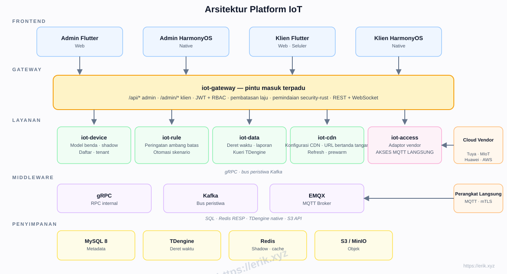
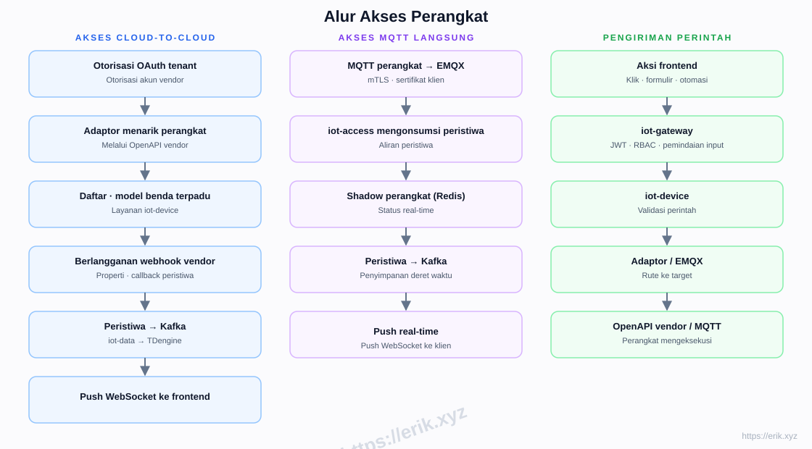
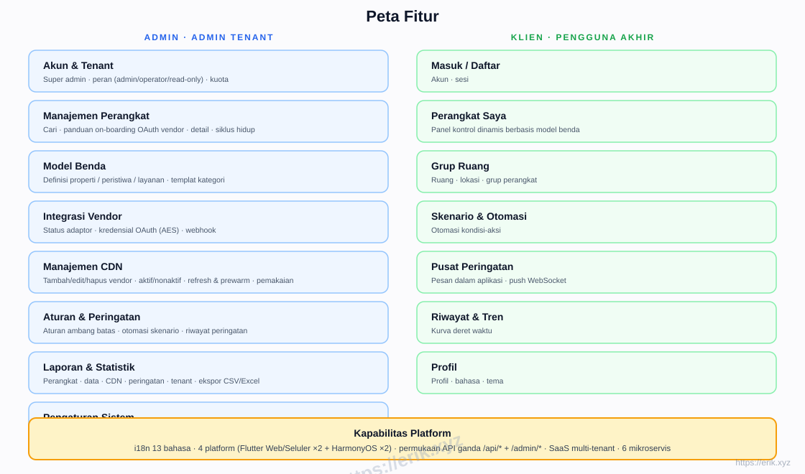
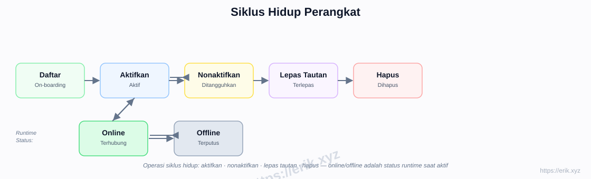
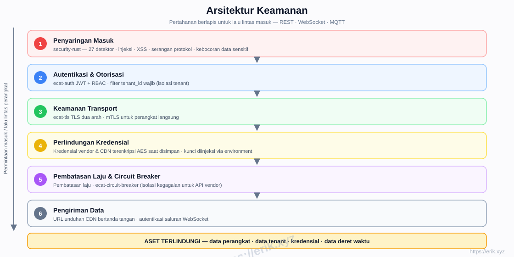

# Platform IoT

[中文](../../README.md) | [English](README.en.md) | [한국어](README.ko.md) | [Русский](README.ru.md) | [Deutsch](README.de.md) | [Français](README.fr.md) | [Español](README.es.md) | [Português](README.pt.md) | [हिन्दी](README.hi.md) | [العربية](README.ar.md) | [বাংলা](README.bn.md) | [Bahasa Indonesia](README.id.md) | [日本語](README.ja.md)

<p align="center">
  
</p>

Platform SaaS IoT satu atap yang menyatukan akses ke vendor perangkat utama dalam dan luar negeri (Tuya, Xiaomi, Huawei, AWS IoT, Azure IoT, dll.), menyediakan manajemen perangkat, model benda, aturan & peringatan, data deret waktu, distribusi CDN, dan aplikasi multi-platform. Backend adalah workspace mikroservis Rust (e-cat), frontend Flutter + HarmonyOS, mendukung 13 bahasa.

## Fitur

- **Integrasi multi-vendor**: OAuth cloud-to-cloud (Tuya / Xiaomi / Huawei / AWS / Azure) + MQTT langsung (mTLS)
- **Model benda**: pemodelan terpadu properti / peristiwa / layanan — dimodelkan di admin, dirender dinamis di klien
- **Siklus hidup perangkat**: daftar → aktif / nonaktif → lepas tautan → hapus, dengan status online / offline saat berjalan
- **Aturan & peringatan**: aturan ambang batas, otomasi skenario, push WebSocket real-time
- **Data & laporan**: penyimpanan deret waktu TDengine, kurva historis, ekspor CSV/Excel
- **Manajemen CDN**: konfigurasi vendor, aktif/nonaktif, refresh & prewarm, URL bertanda tangan
- **SaaS multi-tenant**: isolasi tenant, kuota, peran (admin / operator / read-only)
- **Keamanan**: pemindaian inbound security-rust, JWT + RBAC, TLS dua arah, kredensial terenkripsi AES, pembatasan laju & circuit breaker
- **i18n 13 bahasa**, di Flutter Web / Mobile dan HarmonyOS native (4 aplikasi)

## Arsitektur



## Alur Akses Perangkat



## Peta Fitur



## Siklus Hidup Perangkat



## Arsitektur Keamanan



## Tumpukan Teknologi

| Lapisan | Teknologi |
|----|------|
| Frontend | Flutter (Web / Mobile) · HarmonyOS ArkTS |
| Backend | Rust (axum · tokio · gRPC) · pemindaian security-rust |
| Middleware | EMQX (MQTT) · Kafka (bus peristiwa) · gRPC (RPC internal) |
| Penyimpanan | MySQL 8 (metadata) · TDengine (deret waktu) · Redis (shadow / cache) · S3 / MinIO (objek) |
| Akses | Adaptor OAuth cloud-to-cloud · MQTT langsung (mTLS) |

## Struktur Repositori

```
├── apps/            # Aplikasi frontend
│   ├── admin/       # Konsol admin (Flutter + HarmonyOS)
│   └── client/      # Aplikasi klien (Flutter + HarmonyOS)
├── e-cat/           # Workspace Rust (mikroservis + crate bersama)
│   └── services/    # iot-gateway · iot-device · iot-access · iot-rule · iot-data · iot-cdn
├── ../            # Dokumen, diagram, gambar donasi
├── scripts/         # Skrip build / validasi / smoke test
└── docker-compose.yml  # Orkestrasi infrastruktur (MySQL / Redis / EMQX / Kafka / MinIO)
```

## Fase Implementasi

| Fase | Cakupan |
|------|------|
| P0 Kerangka | Struktur repo, iot-gateway + iot-device + orkestrasi Docker (MySQL/Redis/EMQX/Kafka/MinIO) |
| P1 Akses | iot-access + adaptor Tuya + MQTT langsung |
| P2 Data | iot-data + TDengine + kurva historis |
| P3 Aturan | peringatan iot-rule + otomasi skenario |
| P4 Multi-vendor + CDN | Adaptor Xiaomi/Huawei/AWS/Azure + iot-cdn |
| P5 Frontend | apps/admin + apps/client semua platform |
| P6 Rilis | Penguatan keamanan, uji beban, OTA |

## Dukungan & Donasi

Dukungan Anda adalah kekuatan bagi kelanjutan proyek ini. Donasi sangat kami hargai!

### Pindai untuk Donasi (WeChat Pay / Alipay)

<p>
  
  
</p>

WeChat Pay · Alipay

### Transfer Bank Global

**【Informasi Penerima】**
Nama Penerima: WANG KEXUN
Nomor Rekening: 881015918251

**【Bank Penerima】ZA Bank**
- SWIFT Code: AABLHKHHXXX
- Nama Bank: ZA Bank Limited
- Kode Bank: 387
- Alamat Bank: Core F, Cyberport 3, 100 Cyberport Road, Hong Kong

**【Bank Koresponden untuk Transfer Lintas Batas (jika diperlukan)】**
Perlu diperhatikan, ini adalah informasi bank koresponden (bank perantara) untuk transfer lintas batas, bukan bank penerima. Silakan tanyakan ke bank pengirim apakah informasi bank koresponden diperlukan.

- **Untuk transfer dalam HKD, CNY, dan USD, bank korespondennya adalah Citibank**
- Nama Bank: Citibank N.A. Hong Kong
- SWIFT Code: CITIHKHXXXX
- Kode Bank: 006
- Nama Cabang: Hong Kong Branch
- Kode Cabang: 391
- Alamat Bank: Citibank Tower, Citibank Plaza, 3 Garden Road, Central, Hong Kong

- **Untuk transfer dalam mata uang lain, bank korespondennya adalah BNY Mellon**
- Nama Bank: THE BANK OF NEW YORK MELLON
- SWIFT Code: IRVTUS3NXXX
- Alamat Bank: THE BANK OF NEW YORK MELLON, 240 GREENWICH STREET, NEW YORK, United States

### Donasi Kripto

<p align="center">
  
  
  
  
  
  
  
  
  
  
</p>

| Jaringan | Alamat Dompet |
|------|----------|
| BNB Smart Chain (BEP20) | `0x355d429f97511897ccb4e271ec888205f9ab6629` |
| Tron (TRC20) | `TEdDHWLajt1XvqtPDWmQctdrJaC3pzZZzz` |
| Ethereum (ERC20) | `0x355d429f97511897ccb4e271ec888205f9ab6629` |
| Aptos | `0x836e3780edfc3f7b2372b39e2a1a3a5d7adfaccd96c726f21cfde1b50dd68030` |
| Plasma | `0x355d429f97511897ccb4e271ec888205f9ab6629` |
| Polygon POS | `0x355d429f97511897ccb4e271ec888205f9ab6629` |
| Solana | `2hfhboHdmdrYsY25XfQSsEWxq5ip4EQsR7f4AzSRMUyr` |
| The Open Network (TON) | `UQB9kFQohzmXUir9QSSZq01iwl9aQZIDdBpNmDklljRtCoGK` |
| Arbitrum One | `0x355d429f97511897ccb4e271ec888205f9ab6629` |
| AVAX C-Chain | `0x355d429f97511897ccb4e271ec888205f9ab6629` |

## Lisensi

Kode proyek ini disediakan hanya untuk tujuan pembelajaran dan komunikasi.
