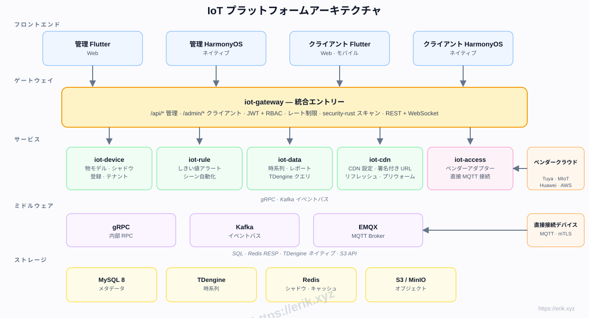
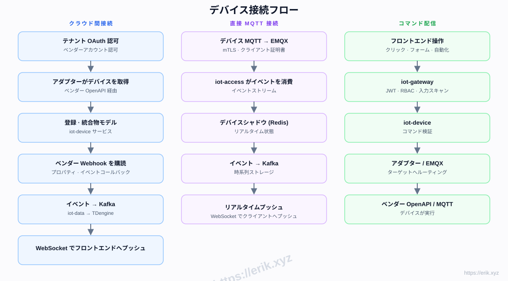
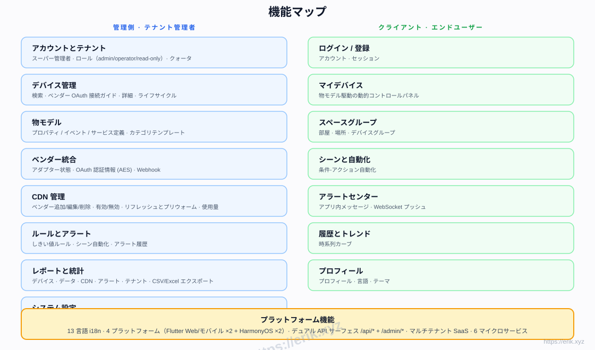
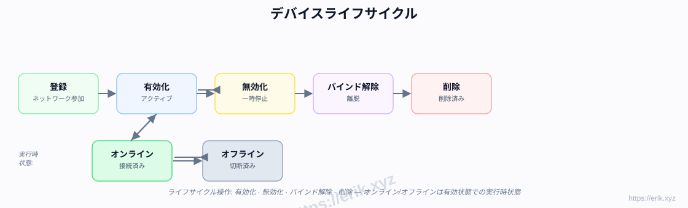
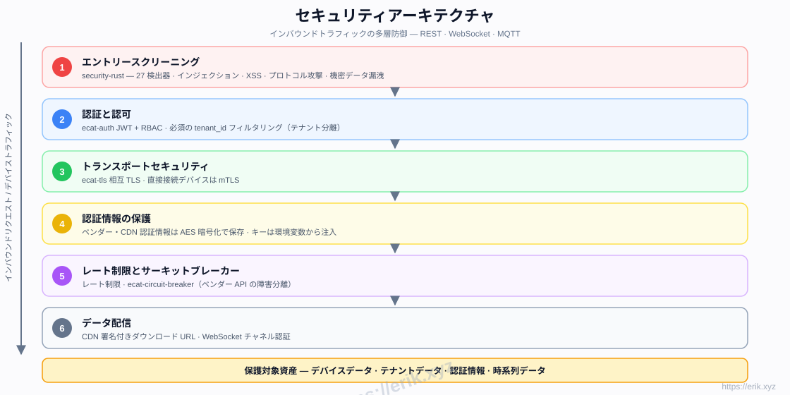

# IoT プラットフォーム

[中文](../../README.md) | [English](README.en.md) | [한국어](README.ko.md) | [Русский](README.ru.md) | [Deutsch](README.de.md) | [Français](README.fr.md) | [Español](README.es.md) | [Português](README.pt.md) | [हिन्दी](README.hi.md) | [العربية](README.ar.md) | [বাংলা](README.bn.md) | [Bahasa Indonesia](README.id.md) | [日本語](README.ja.md)

<p align="center">
  
</p>

国内外の主要デバイスベンダー（Tuya、Xiaomi、Huawei、AWS IoT、Azure IoT など）を統一的に接続し、デバイス管理、物モデル、ルール・アラート、時系列データ、CDN 配信、マルチプラットフォームアプリを提供するワンストップ SaaS IoT プラットフォームです。バックエンドは Rust マイクロサービスワークスペース（e-cat）、フロントエンドは Flutter + HarmonyOS で、13 言語に対応しています。

## 機能

- **マルチベンダー接続**: クラウド間 OAuth（Tuya / Xiaomi / Huawei / AWS / Azure）+ 直接 MQTT（mTLS）
- **物モデル**: プロパティ / イベント / サービスの統一的モデリング — 管理側でモデリング、クライアント側で動的レンダリング
- **デバイスライフサイクル**: 登録 → 有効 / 無効 → バインド解除 → 削除、実行時のオンライン / オフライン状態
- **ルールとアラート**: しきい値ルール、シーン自動化、WebSocket リアルタイムプッシュ
- **データとレポート**: TDengine 時系列ストレージ、履歴カーブ、CSV/Excel エクスポート
- **CDN 管理**: ベンダー設定、有効/無効、リフレッシュとプリウォーム、署名付き URL
- **マルチテナント SaaS**: テナント分離、クォータ、ロール権限（admin / operator / read-only）
- **セキュリティ**: security-rust インバウンドスキャン、JWT + RBAC、相互 TLS、AES 暗号化された認証情報、レート制限とサーキットブレーカー
- **13 言語 i18n**、Flutter Web / Mobile とネイティブ HarmonyOS（4 アプリ）

## アーキテクチャ



## デバイス接続フロー



## 機能マップ



## デバイスライフサイクル



## セキュリティアーキテクチャ



## 技術スタック

| レイヤー | 技術 |
|----|------|
| フロントエンド | Flutter (Web / Mobile) · HarmonyOS ArkTS |
| バックエンド | Rust (axum · tokio · gRPC) · security-rust スキャン |
| ミドルウェア | EMQX (MQTT) · Kafka (イベントバス) · gRPC (内部 RPC) |
| ストレージ | MySQL 8 (メタデータ) · TDengine (時系列) · Redis (シャドウ / キャッシュ) · S3 / MinIO (オブジェクト) |
| 接続 | クラウド間 OAuth アダプター · 直接 MQTT (mTLS) |

## リポジトリ構成

```
├── apps/            # フロントエンドアプリ
│   ├── admin/       # 管理コンソール (Flutter + HarmonyOS)
│   └── client/      # クライアントアプリ (Flutter + HarmonyOS)
├── e-cat/           # Rust 工作区（框架 + 业务微服务一体）
│   └── ecat*/       # 框架公共库 + 业务微服务（ecat · ecat-auth · ecat-gateway · ecat-device · ecat-access · ecat-rule · ecat-data-service · ecat-data-* …）
├── ../            # ドキュメント、図、寄付画像
├── scripts/         # ビルド / 検証 / スモークテストスクリプト
└── docker-compose.yml  # 基础设施编排（MySQL / Redis / EMQX / Kafka / MinIO / TDengine）
```

## ワンクリックインストール

```bash
git clone https://github.com/erikwang2013/iot-platform.git
cd iot-platform
./scripts/install.sh
```

スクリプトが自動で実行します：インフラ起動（MySQL / Redis / EMQX / Kafka / MinIO / TDengine）→ 6 つの業務サービスをビルド → .env 設定を生成 → サービス一覧と起動コマンドを表示。再実行しても安全です。

## インストールガイド

### 前提条件

- Docker 24+ と docker compose（または docker-compose）
- Rust 1.80+（stable。業務サービスのコンパイルに使用。cargo があればスクリプトが自動ビルド）
- ポート空き確認：8080-8085、3306、6379、1883、9092、9000-9001、6041 が空いている必要があります

### インストール手順

1. インフラのインストールと起動：`./scripts/install.sh` が `docker compose up -d` を実行します
2. 業務サービスのビルド：cargo を検出すると自動で `cargo build --release` を実行し、バイナリを `scripts/bin/` に出力（`e-cat/target/release/` の成果物を直接使うことも可）
3. サービスの起動：スクリプト末尾に表示されるコマンドで 6 つの業務サービスを順に起動
4. DB マイグレーション：サービス起動時に自動実行、手動操作は不要。初回起動時に iot-access が既定テナントと管理者アカウントを作成

## 使い方

### ログイン

- 管理画面：既定アカウント `admin / admin123`（テナント `tenant-1`）でログイン

### サービスポート

| サービス | ポート |
|------|------|
| iot-gateway（ゲートウェイ / 公開 API） | 8080 |
| iot-device（デバイスサービス） | 8081 |
| iot-access（接続 / 認証） | 8082 |
| iot-data（データサービス） | 8083 |
| iot-rule（ルールエンジン） | 8084 |
| iot-cdn（CDN 管理） | 8085 |
| MySQL / Redis / EMQX / Kafka / MinIO / TDengine | 3306 / 6379 / 1883 / 9092 / 9000 / 6041 |

### モジュールの使い方

- **デバイス管理**：管理画面でデバイスを追加 → ベンダー OAuth 接続または直接 MQTT を選択。詳細でオンライン状態とライフサイクルを確認
- **物モデル**：デバイスカテゴリにプロパティ / イベント / サービスを定義、クライアントのコントロールパネルが自動レンダリング
- **ルールとアラート**：しきい値ルールとシーン自動化を設定、トリガー後は WebSocket でリアルタイム通知
- **履歴データ**：iot-data が時系列データを保存。履歴カーブの閲覧と CSV / Excel エクスポート
- **レポートと統計**：デバイス / データ / CDN / アラート / テナントの多次元レポート
- **CDN 管理**：複数ベンダーの CDN を設定、リフレッシュ / プリウォームと署名付き URL に対応
- **マルチベンダー接続**：Tuya / Xiaomi / Huawei / AWS / Azure のクラウド間 OAuth アダプター

## 実装フェーズ

| フェーズ | 内容 |
|------|------|
| P0 スケルトン | リポジトリ構成、iot-gateway + iot-device + Docker 構成 (MySQL/Redis/EMQX/Kafka/MinIO) |
| P1 接続 | iot-access + Tuya アダプター + 直接 MQTT |
| P2 データ | iot-data + TDengine + 履歴カーブ |
| P3 ルール | iot-rule アラート + シーン自動化 |
| P4 マルチベンダー + CDN | Xiaomi/Huawei/AWS/Azure アダプター + iot-cdn |
| P5 フロントエンド | apps/admin + apps/client 全プラットフォーム |
| P6 リリース | セキュリティ強化、負荷テスト、OTA |

## サポートと寄付

皆様のご支援がプロジェクトの継続的な発展の原動力です。寄付大歓迎、心から感謝いたします！

### スキャンして寄付（WeChat Pay / Alipay）

<p>
  
  
</p>

WeChat Pay · Alipay

### グローバル銀行振込

**【受取人情報】**
受取人名: WANG KEXUN
口座番号: 881015918251

**【受取銀行】ZA Bank**
- SWIFT コード: AABLHKHHXXX
- 銀行名: ZA Bank Limited
- 銀行コード: 387
- 銀行住所: Core F, Cyberport 3, 100 Cyberport Road, Hong Kong

**【クロスボーダー送金のコルレス銀行（必要な場合）】**
これはクロスボーダー送金用のコルレス銀行（中継銀行）の情報であり、受取銀行の情報ではありません。送金銀行にコルレス銀行情報の提供が必要かどうかをお問い合わせください。

- **HKD・CNY・USD での送金の場合、コルレス銀行は Citibank です**
- 銀行名: Citibank N.A. Hong Kong
- SWIFT コード: CITIHKHXXXX
- 銀行コード: 006
- 支店名: Hong Kong Branch
- 支店コード: 391
- 銀行住所: Citibank Tower, Citibank Plaza, 3 Garden Road, Central, Hong Kong

- **その他の通貨での送金の場合、コルレス銀行は BNY Mellon です**
- 銀行名: THE BANK OF NEW YORK MELLON
- SWIFT コード: IRVTUS3NXXX
- 銀行住所: THE BANK OF NEW YORK MELLON, 240 GREENWICH STREET, NEW YORK, United States

### 暗号資産での寄付

| Coin | Network | Wallet Address |
|------|---------|----------------|
| [](../coin/1.jpg) | BNB Smart Chain (BEP20) | `0x355d429f97511897ccb4e271ec888205f9ab6629` |
| [](../coin/2.jpg) | Tron (TRC20) | `TEdDHWLajt1XvqtPDWmQctdrJaC3pzZZzz` |
| [](../coin/3.jpg) | Ethereum (ERC20) | `0x355d429f97511897ccb4e271ec888205f9ab6629` |
| [](../coin/4.jpg) | Aptos | `0x836e3780edfc3f7b2372b39e2a1a3a5d7adfaccd96c726f21cfde1b50dd68030` |
| [](../coin/5.jpg) | Plasma | `0x355d429f97511897ccb4e271ec888205f9ab6629` |
| [](../coin/6.jpg) | Polygon POS | `0x355d429f97511897ccb4e271ec888205f9ab6629` |
| [](../coin/7.jpg) | Solana | `2hfhboHdmdrYsY25XfQSsEWxq5ip4EQsR7f4AzSRMUyr` |
| [](../coin/8.jpg) | The Open Network (TON) | `UQB9kFQohzmXUir9QSSZq01iwl9aQZIDdBpNmDklljRtCoGK` |
| [](../coin/9.jpg) | Arbitrum One | `0x355d429f97511897ccb4e271ec888205f9ab6629` |
| [](../coin/10.jpg) | AVAX C-Chain | `0x355d429f97511897ccb4e271ec888205f9ab6629` |

## ライセンス

このプロジェクトのコードは学習・交流目的のみで提供されています。
