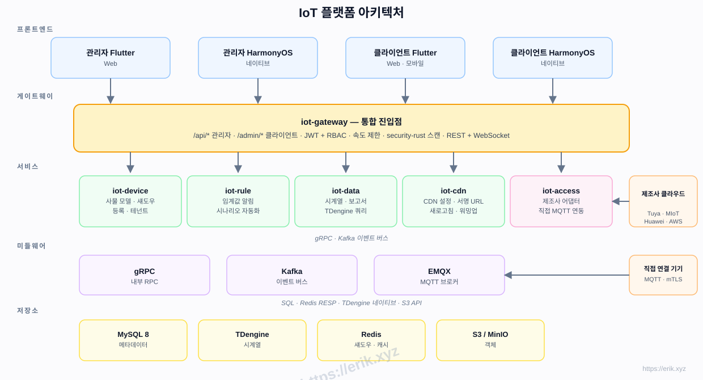
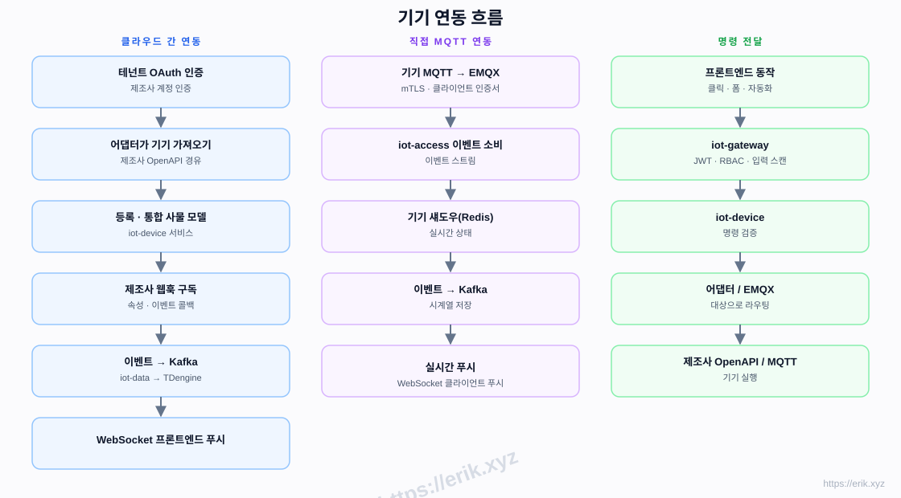
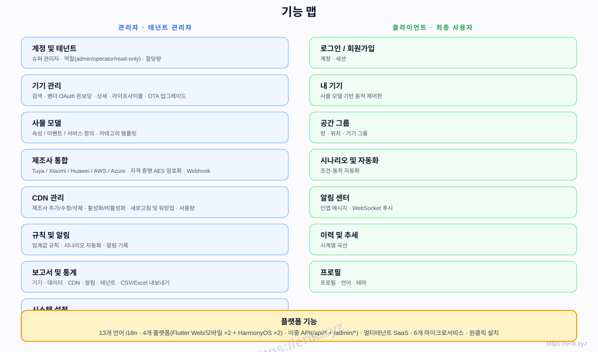
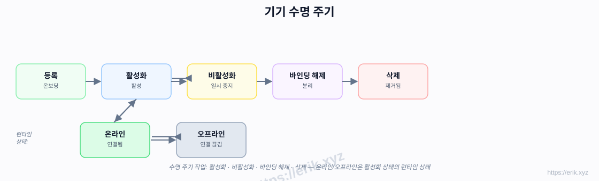
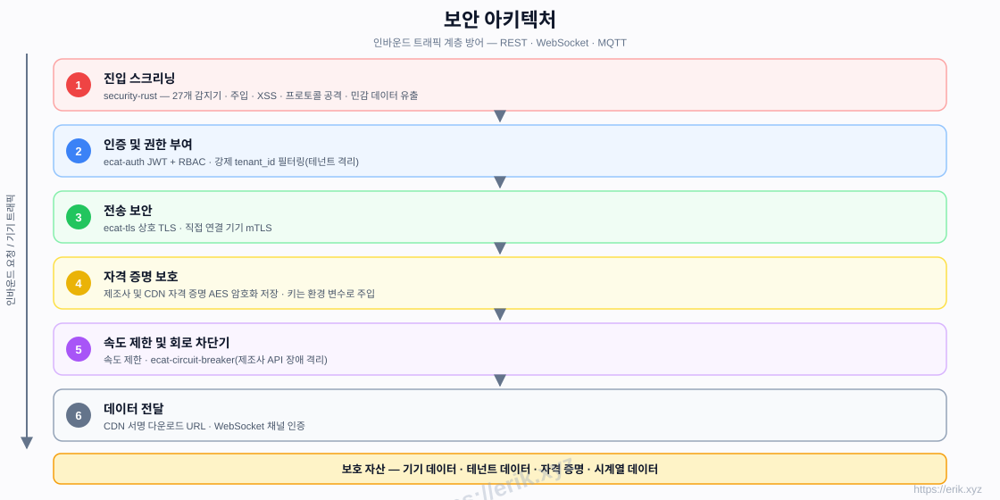

# IoT 플랫폼

[中文](../../README.md) | [English](README.en.md) | [한국어](README.ko.md) | [Русский](README.ru.md) | [Deutsch](README.de.md) | [Français](README.fr.md) | [Español](README.es.md) | [Português](README.pt.md) | [हिन्दी](README.hi.md) | [العربية](README.ar.md) | [বাংলা](README.bn.md) | [Bahasa Indonesia](README.id.md) | [日本語](README.ja.md)

<p align="center">
  
</p>

국내외 주요 기기 제조사(투야, 샤오미, 화웨이, AWS IoT, Azure IoT 등)를 통합 연결하는 원스톱 SaaS IoT 플랫폼으로, 기기 관리, 사물 모델, 규칙 및 알림, 시계열 데이터, CDN 배포, 멀티 플랫폼 앱을 제공합니다. 백엔드는 Rust 마이크로서비스(e-cat 워크스페이스), 프론트엔드는 Flutter + HarmonyOS이며 13개 언어를 지원합니다.

## 주요 기능

- **다중 제조사 연동**: 클라우드 간 OAuth 연동(투야 / 샤오미 / 화웨이 / AWS / Azure) + 직접 MQTT(mTLS)
- **사물 모델**: 속성 / 이벤트 / 서비스 통합 모델링 — 관리자에서 모델링, 클라이언트에서 동적 렌더링
- **기기 수명 주기**: 등록 → 활성화 / 비활성화 → 바인딩 해제 → 삭제, 런타임 온라인 / 오프라인 상태
- **규칙 및 알림**: 임계값 규칙, 시나리오 자동화, WebSocket 실시간 푸시
- **데이터 및 보고서**: TDengine 시계열 저장, 이력 곡선, CSV/Excel 내보내기
- **CDN 관리**: 공급업체 설정, 활성화 / 비활성화, 새로고침 및 워밍업, 서명 URL
- **멀티 테넌트 SaaS**: 테넌트 격리, 할당량, 역할 권한(admin / operator / read-only)
- **보안**: security-rust 인바운드 스캔, JWT + RBAC, 상호 TLS, 자격 증명 AES 암호화, 속도 제한 및 회로 차단기
- **13개 언어 i18n**, Flutter Web / Mobile 및 네이티브 HarmonyOS(4개 앱)

## 아키텍처



## 기기 연동 흐름



## 기능 맵



## 수명 주기



## 보안 아키텍처



## 기술 스택

| 계층 | 기술 |
|----|------|
| 프론트엔드 | Flutter(Web / Mobile) · HarmonyOS ArkTS |
| 백엔드 | Rust(axum · tokio · gRPC) · security-rust 스캔 |
| 미들웨어 | EMQX(MQTT) · Kafka(이벤트 버스) · gRPC(내부 RPC) |
| 저장소 | MySQL 8(메타데이터) · TDengine(시계열) · Redis(섀도우 / 캐시) · S3 / MinIO(객체) |
| 연동 | 클라우드 간 OAuth 어댑터 · 직접 MQTT(mTLS) |

## 저장소 구조

```
├── apps/            # 프론트엔드 앱
│   ├── admin/       # 관리자 콘솔(Flutter + HarmonyOS)
│   └── client/      # 클라이언트 앱(Flutter + HarmonyOS)
├── e-cat/           # Rust 工作区（框架 + 业务微服务一体）
│   └── ecat*/       # 框架公共库 + 业务微服务（ecat · ecat-auth · ecat-gateway · ecat-device · ecat-access · ecat-rule · ecat-data-service · ecat-data-* …）
├── ../            # 문서, 다이어그램, 후원 이미지
├── scripts/         # 빌드 / 검증 / 스모크 테스트 스크립트
└── docker-compose.yml  # 基础设施编排（MySQL / Redis / EMQX / Kafka / MinIO / TDengine）
```

## 원클릭 설치

```bash
git clone https://github.com/erikwang2013/iot-platform.git
cd iot-platform
./scripts/install.sh
```

스크립트가 자동으로: 인프라 기동(MySQL / Redis / EMQX / Kafka / MinIO / TDengine) → 6개 비즈니스 서비스 빌드 → .env 설정 생성 → 서비스 목록과 시작 명령 출력. 반복 실행해도 안전합니다.

## 설치 안내

### 사전 요구 사항

- Docker 24+ 및 docker compose(또는 docker-compose)
- Rust 1.80+(stable, 서비스 컴파일용. cargo가 설치되어 있으면 스크립트가 자동 빌드)
- 포트 점유 확인: 8080-8085, 3306, 6379, 1883, 9092, 9000-9001, 6041이 비어 있어야 함

### 설치 단계

1. 인프라 설치 및 시작: `./scripts/install.sh`가 `docker compose up -d`를 실행합니다
2. 서비스 빌드: cargo가 감지되면 자동으로 `cargo build --release` 실행, 바이너리는 `scripts/bin/`에 출력(`e-cat/target/release/` 결과물 직접 사용 가능)
3. 서비스 시작: 스크립트 끝에 출력된 명령으로 6개 서비스를 하나씩 시작
4. DB 마이그레이션: 서비스 시작 시 자동 실행, 수동 작업 불필요. 첫 실행 시 iot-access가 기본 테넌트와 관리자 계정을 생성

## 사용 방법

### 로그인

- 관리자 콘솔: 기본 계정 `admin / admin123`(테넌트 `tenant-1`)으로 로그인

### 서비스 포트

| 서비스 | 포트 |
|------|------|
| iot-gateway(게이트웨이 / 공개 API) | 8080 |
| iot-device(디바이스 서비스) | 8081 |
| iot-access(접속 / 인증) | 8082 |
| iot-data(데이터 서비스) | 8083 |
| iot-rule(규칙 엔진) | 8084 |
| iot-cdn(CDN 관리) | 8085 |
| MySQL / Redis / EMQX / Kafka / MinIO / TDengine | 3306 / 6379 / 1883 / 9092 / 9000 / 6041 |

### 모듈 사용법

- **디바이스 관리**: 관리자 콘솔에서 디바이스 추가 → 벤더 OAuth 또는 직접 MQTT 선택, 상세에서 온라인 상태와 라이프사이클 확인
- **사물 모델**: 디바이스 카테고리에 속성 / 이벤트 / 서비스 정의, 클라이언트 제어판이 자동 렌더링
- **규칙 및 알림**: 임계값 규칙과 시나리오 자동화 설정, 트리거 시 WebSocket으로 실시간 푸시
- **이력 데이터**: iot-data가 시계열 데이터 저장, 이력 곡선 조회 및 CSV / Excel 내보내기
- **보고서 및 통계**: 디바이스 / 데이터 / CDN / 알림 / 테넌트 다차원 보고서
- **CDN 관리**: 멀티 벤더 CDN 설정, 리프레시 / 프리웜 및 서명 URL 지원
- **멀티 벤더 접속**: Tuya / Xiaomi / Huawei / AWS / Azure 클라우드 간 OAuth 어댑터

## 구현 단계

| 단계 | 범위 |
|------|------|
| P0 골격 | 저장소 구조, iot-gateway + iot-device + Docker 오케스트레이션(MySQL/Redis/EMQX/Kafka/MinIO) |
| P1 연동 | iot-access + 투야 어댑터 + 직접 MQTT |
| P2 데이터 | iot-data + TDengine + 이력 곡선 |
| P3 규칙 | iot-rule 알림 + 시나리오 자동화 |
| P4 다중 제조사 + CDN | 샤오미/화웨이/AWS/Azure 어댑터 + iot-cdn |
| P5 프론트엔드 | apps/admin + apps/client 전체 |
| P6 출시 | 보안 강화, 부하 테스트, OTA |

## 지원 및 후원

여러분의 지원은 프로젝트가 지속 발전하는 원동력입니다. 후원해 주시면 정말 감사하겠습니다!

### QR 코드 후원(WeChat Pay / Alipay)

<p>
  
  
</p>

WeChat Pay · Alipay

### 글로벌 송금 후원(은행 송금)

**【수취인 정보】**
수취인 이름: WANG KEXUN
계좌 번호: 881015918251

**【수취 은행】ZA Bank**
- SWIFT 코드: AABLHKHHXXX
- 은행 이름: ZA Bank Limited
- 은행 코드: 387
- 은행 주소: Core F, Cyberport 3, 100 Cyberport Road, Hong Kong

**【해외 송금 중개 은행(필요 시)**】
이 정보는 해외 송금 시 중개(중간) 은행 정보로, 수취 은행 정보가 아닙니다. 중개 은행 정보가 필요한지 송금 은행에 문의하시기 바랍니다.

- **HKD, CNY, USD 송금 시 중개 은행은 Citibank입니다**
- 은행 이름: Citibank N.A. Hong Kong
- SWIFT 코드: CITIHKHXXXX
- 은행 코드: 006
- 지점 이름: Hong Kong Branch
- 지점 코드: 391
- 은행 주소: Citibank Tower, Citibank Plaza, 3 Garden Road, Central, Hong Kong

- **기타 통화 송금 시 중개 은행은 BNY Mellon입니다**
- 은행 이름: THE BANK OF NEW YORK MELLON
- SWIFT 코드: IRVTUS3NXXX
- 은행 주소: THE BANK OF NEW YORK MELLON, 240 GREENWICH STREET, NEW YORK, United States

### 암호화폐 후원

| Coin | Network | Wallet Address |
|------|---------|----------------|
| [](../coin/1.jpg) | BNB Smart Chain (BEP20) | `0x355d429f97511897ccb4e271ec888205f9ab6629` |
| [](../coin/2.jpg) | Tron (TRC20) | `TEdDHWLajt1XvqtPDWmQctdrJaC3pzZZzz` |
| [](../coin/3.jpg) | Ethereum (ERC20) | `0x355d429f97511897ccb4e271ec888205f9ab6629` |
| [](../coin/4.jpg) | Aptos | `0x836e3780edfc3f7b2372b39e2a1a3a5d7adfaccd96c726f21cfde1b50dd68030` |
| [](../coin/5.jpg) | Plasma | `0x355d429f97511897ccb4e271ec888205f9ab6629` |
| [](../coin/6.jpg) | Polygon POS | `0x355d429f97511897ccb4e271ec888205f9ab6629` |
| [](../coin/7.jpg) | Solana | `2hfhboHdmdrYsY25XfQSsEWxq5ip4EQsR7f4AzSRMUyr` |
| [](../coin/8.jpg) | The Open Network (TON) | `UQB9kFQohzmXUir9QSSZq01iwl9aQZIDdBpNmDklljRtCoGK` |
| [](../coin/9.jpg) | Arbitrum One | `0x355d429f97511897ccb4e271ec888205f9ab6629` |
| [](../coin/10.jpg) | AVAX C-Chain | `0x355d429f97511897ccb4e271ec888205f9ab6629` |

## 라이선스

이 프로젝트의 코드는 학습 및 교류 목적으로만 제공됩니다.
