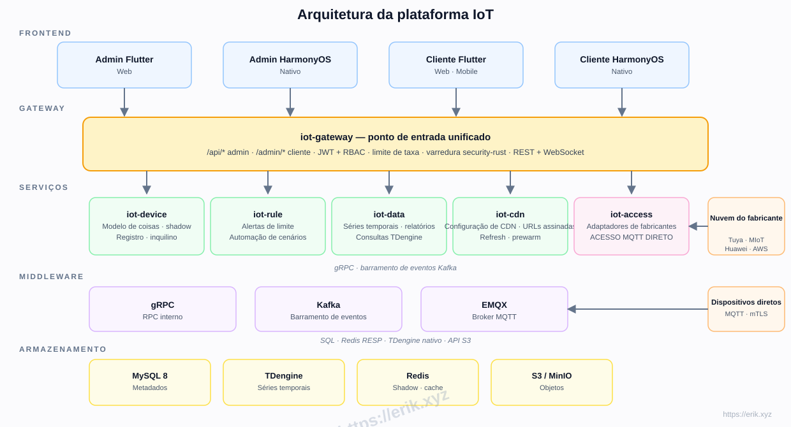
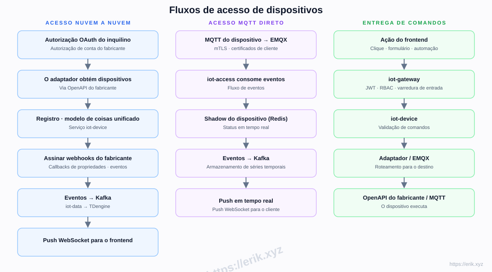
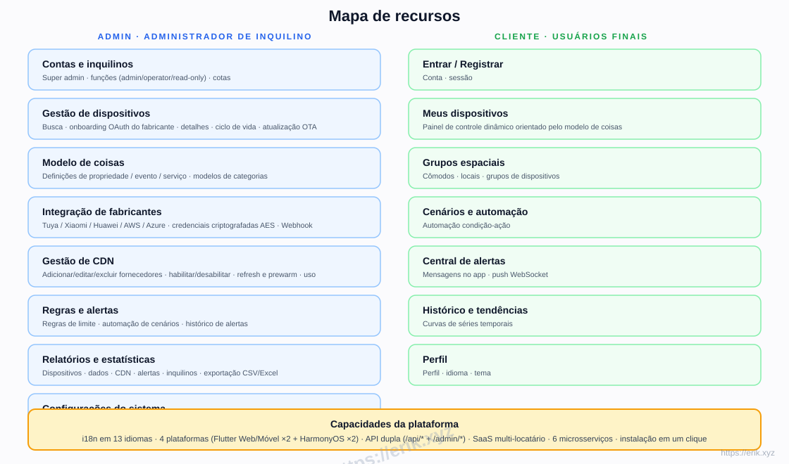
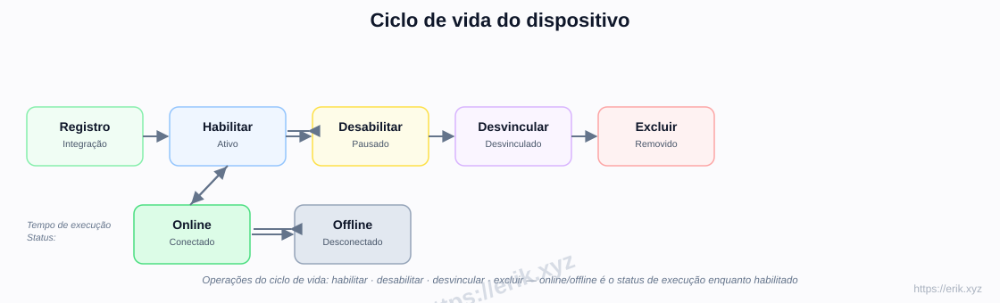
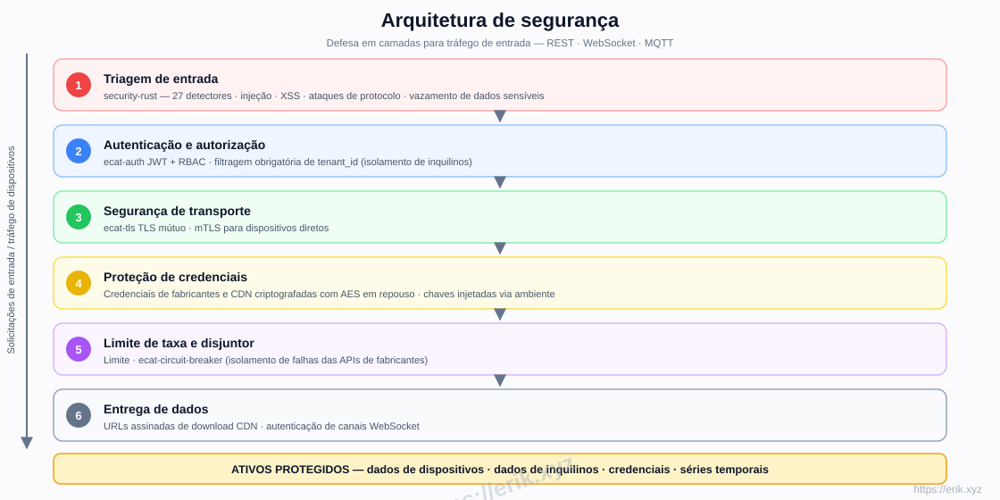

# Plataforma IoT

[中文](../../README.md) | [English](README.en.md) | [한국어](README.ko.md) | [Русский](README.ru.md) | [Deutsch](README.de.md) | [Français](README.fr.md) | [Español](README.es.md) | [Português](README.pt.md) | [हिन्दी](README.hi.md) | [العربية](README.ar.md) | [বাংলা](README.bn.md) | [Bahasa Indonesia](README.id.md) | [日本語](README.ja.md)

<p align="center">
  
</p>

Uma plataforma SaaS de IoT tudo-em-um que unifica o acesso aos principais fabricantes de dispositivos nacionais e internacionais (Tuya, Xiaomi, Huawei, AWS IoT, Azure IoT, etc.), oferecendo gestão de dispositivos, modelos de coisas, regras e alertas, dados de séries temporais, entrega via CDN e aplicativos multiplataforma. O backend é um workspace de microsserviços Rust (e-cat), os frontends são Flutter + HarmonyOS, com suporte a 13 idiomas.

## Recursos

- **Acesso multi-fabricante**: OAuth nuvem a nuvem (Tuya / Xiaomi / Huawei / AWS / Azure) + MQTT direto (mTLS)
- **Modelo de coisas**: modelagem unificada de propriedade / evento / serviço — modelado no admin, renderizado dinamicamente no cliente
- **Ciclo de vida do dispositivo**: registro → habilitar / desabilitar → desvincular → excluir, com status online / offline em tempo de execução
- **Regras e alertas**: regras de limite, automação de cenários, push WebSocket em tempo real
- **Dados e relatórios**: armazenamento de séries temporais TDengine, curvas históricas, exportação CSV/Excel
- **Gestão de CDN**: configuração de fornecedores, habilitar / desabilitar, refresh e prewarm, URLs assinadas
- **SaaS multi-tenant**: isolamento de inquilinos, cotas, funções (admin / operator / read-only)
- **Segurança**: varredura de entrada security-rust, JWT + RBAC, TLS mútuo, credenciais criptografadas com AES, limite de taxa e disjuntor
- **i18n em 13 idiomas**, Flutter Web / Mobile e HarmonyOS nativo (4 aplicativos)

## Arquitetura



## Fluxos de acesso de dispositivos



## Mapa de recursos



## Ciclo de vida do dispositivo



## Arquitetura de segurança



## Pilha de tecnologia

| Camada | Tecnologia |
|----|------|
| Frontend | Flutter (Web / Mobile) · HarmonyOS ArkTS |
| Backend | Rust (axum · tokio · gRPC) · varredura security-rust |
| Middleware | EMQX (MQTT) · Kafka (barramento de eventos) · gRPC (RPC interno) |
| Armazenamento | MySQL 8 (metadados) · TDengine (séries temporais) · Redis (shadow / cache) · S3 / MinIO (objetos) |
| Acesso | Adaptadores OAuth nuvem a nuvem · MQTT direto (mTLS) |

## Estrutura do repositório

```
├── apps/            # Aplicativos frontend
│   ├── admin/       # Console de administração (Flutter + HarmonyOS)
│   └── client/      # Aplicativo cliente (Flutter + HarmonyOS)
├── e-cat/           # Workspace Rust (microsserviços + crates compartilhados)
│   └── services/    # iot-gateway · iot-device · iot-access · iot-rule · iot-data · iot-cdn
├── ../            # Documentação, diagramas, imagens de doações
├── scripts/         # Scripts de build / validação / smoke tests
└── docker-compose.yml  # Infraestrutura (MySQL / Redis / EMQX / Kafka / MinIO)
```

## Fases de implementação

| Fase | Escopo |
|------|------|
| P0 Esqueleto | Estrutura do repo, iot-gateway + iot-device + orquestração Docker (MySQL/Redis/EMQX/Kafka/MinIO) |
| P1 Acesso | iot-access + adaptador Tuya + MQTT direto |
| P2 Dados | iot-data + TDengine + curvas históricas |
| P3 Regras | alertas iot-rule + automação de cenários |
| P4 Multi-fabricante + CDN | Adaptadores Xiaomi/Huawei/AWS/Azure + iot-cdn |
| P5 Frontend | apps/admin + apps/client completos |
| P6 Lançamento | Endurecimento de segurança, testes de carga, OTA |

## Suporte e doações

Seu apoio impulsiona o projeto. Doações são bem-vindas, muito obrigado!

### Doar por QR code (WeChat Pay / Alipay)

<p>
  
  
</p>

WeChat Pay · Alipay

### Transferência bancária internacional

**【Informações do beneficiário】**
Nome do beneficiário: WANG KEXUN
Número da conta: 881015918251

**【Banco do beneficiário】ZA Bank**
- Código SWIFT: AABLHKHHXXX
- Nome do banco: ZA Bank Limited
- Código do banco: 387
- Endereço do banco: Core F, Cyberport 3, 100 Cyberport Road, Hong Kong

**【Banco correspondente para remessas internacionais (se necessário)**】**
Observe que estas são as informações do banco correspondente (intermediário) para remessas internacionais, não do banco do beneficiário. Consulte seu banco emissor se as informações do banco correspondente são necessárias.

- **Para remessas em HKD, CNY e USD, o banco correspondente é o Citibank**
- Nome do banco: Citibank N.A. Hong Kong
- Código SWIFT: CITIHKHXXXX
- Código do banco: 006
- Nome da agência: Hong Kong Branch
- Código da agência: 391
- Endereço do banco: Citibank Tower, Citibank Plaza, 3 Garden Road, Central, Hong Kong

- **Para remessas em outras moedas, o banco correspondente é o BNY Mellon**
- Nome do banco: THE BANK OF NEW YORK MELLON
- Código SWIFT: IRVTUS3NXXX
- Endereço do banco: THE BANK OF NEW YORK MELLON, 240 GREENWICH STREET, NEW YORK, United States

### Doações em criptomoedas

<p align="center">
  
  
  
  
  
  
  
  
  
  
</p>

| Rede | Endereço da carteira |
|------|----------|
| BNB Smart Chain (BEP20) | `0x355d429f97511897ccb4e271ec888205f9ab6629` |
| Tron (TRC20) | `TEdDHWLajt1XvqtPDWmQctdrJaC3pzZZzz` |
| Ethereum (ERC20) | `0x355d429f97511897ccb4e271ec888205f9ab6629` |
| Aptos | `0x836e3780edfc3f7b2372b39e2a1a3a5d7adfaccd96c726f21cfde1b50dd68030` |
| Plasma | `0x355d429f97511897ccb4e271ec888205f9ab6629` |
| Polygon POS | `0x355d429f97511897ccb4e271ec888205f9ab6629` |
| Solana | `2hfhboHdmdrYsY25XfQSsEWxq5ip4EQsR7f4AzSRMUyr` |
| The Open Network (TON) | `UQB9kFQohzmXUir9QSSZq01iwl9aQZIDdBpNmDklljRtCoGK` |
| Arbitrum One | `0x355d429f97511897ccb4e271ec888205f9ab6629` |
| AVAX C-Chain | `0x355d429f97511897ccb4e271ec888205f9ab6629` |

## Licença

O código deste projeto é fornecido apenas para fins de aprendizado e intercâmbio.
