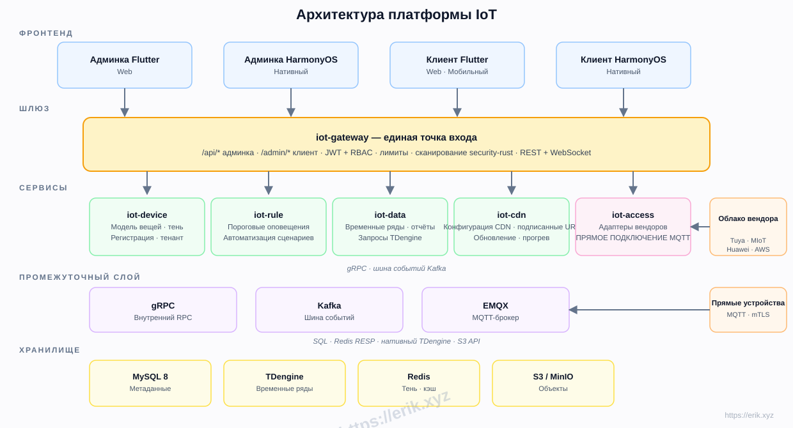
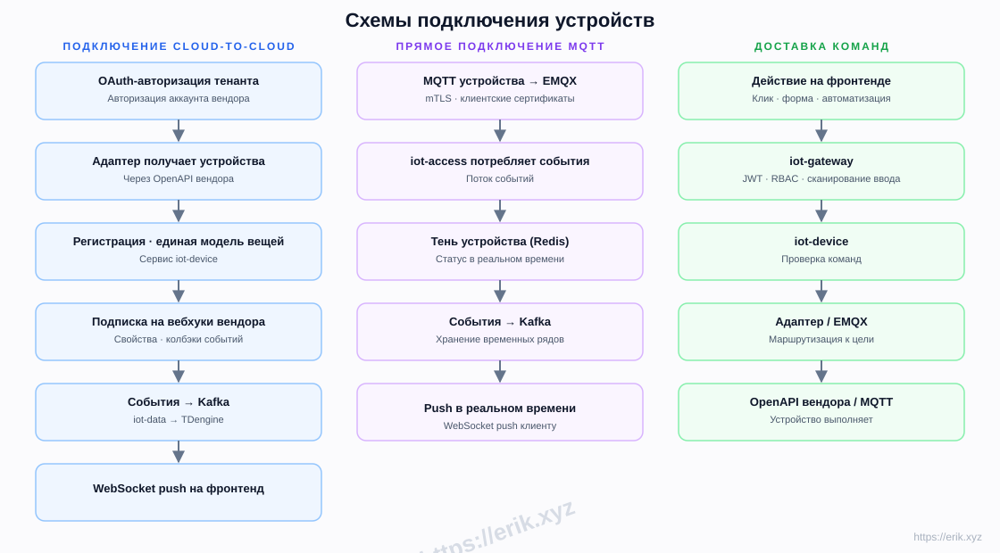
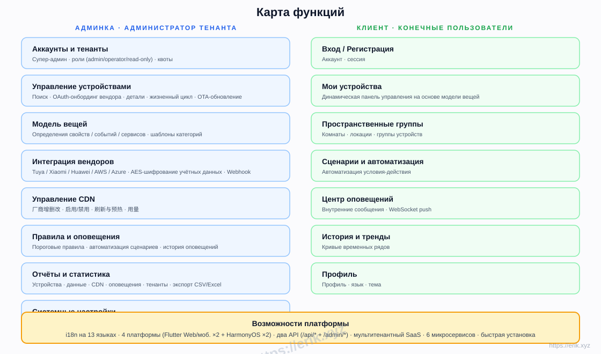
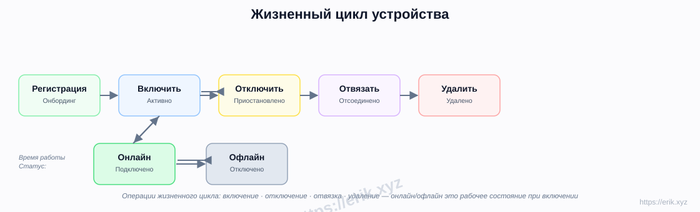
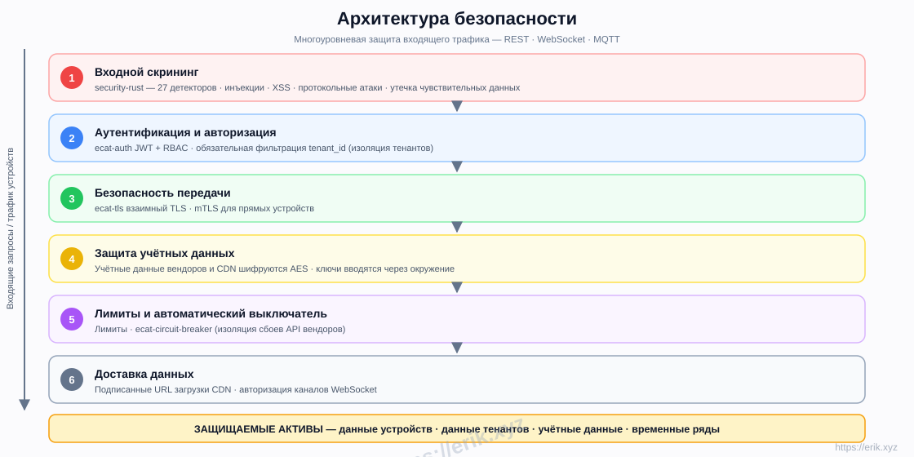
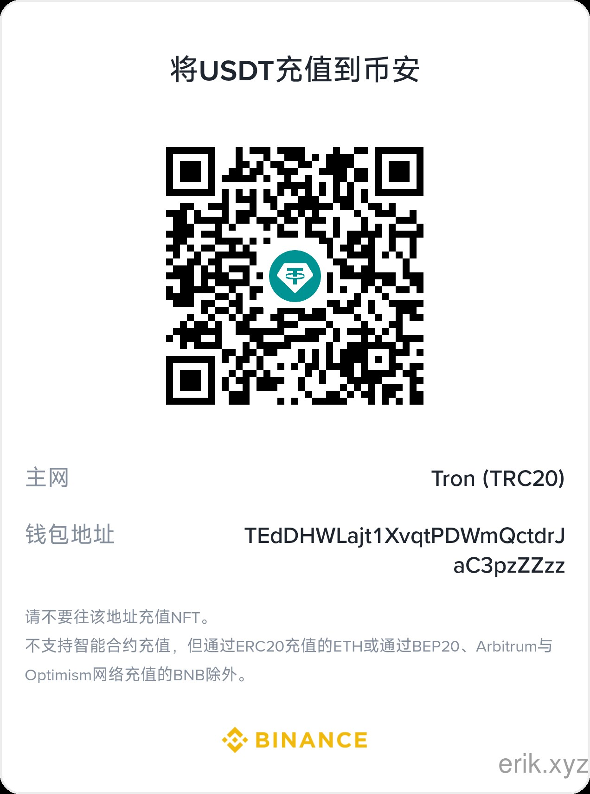
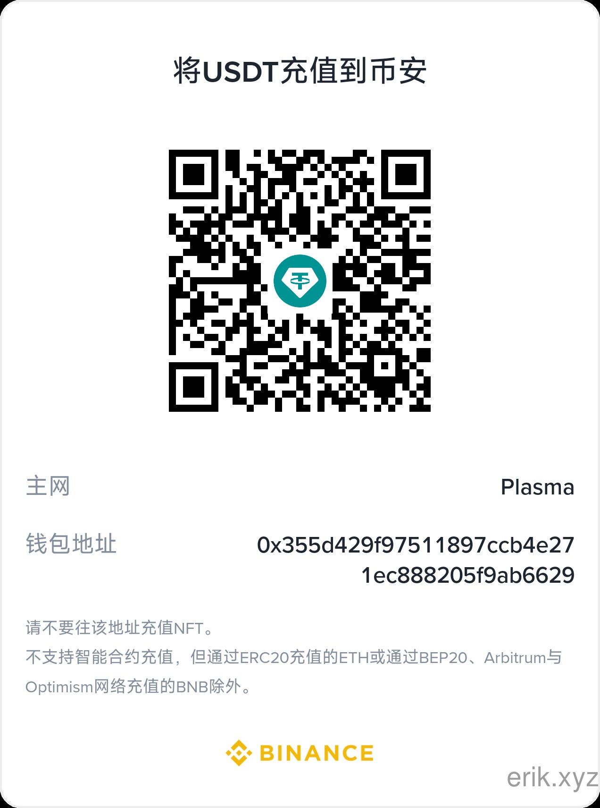
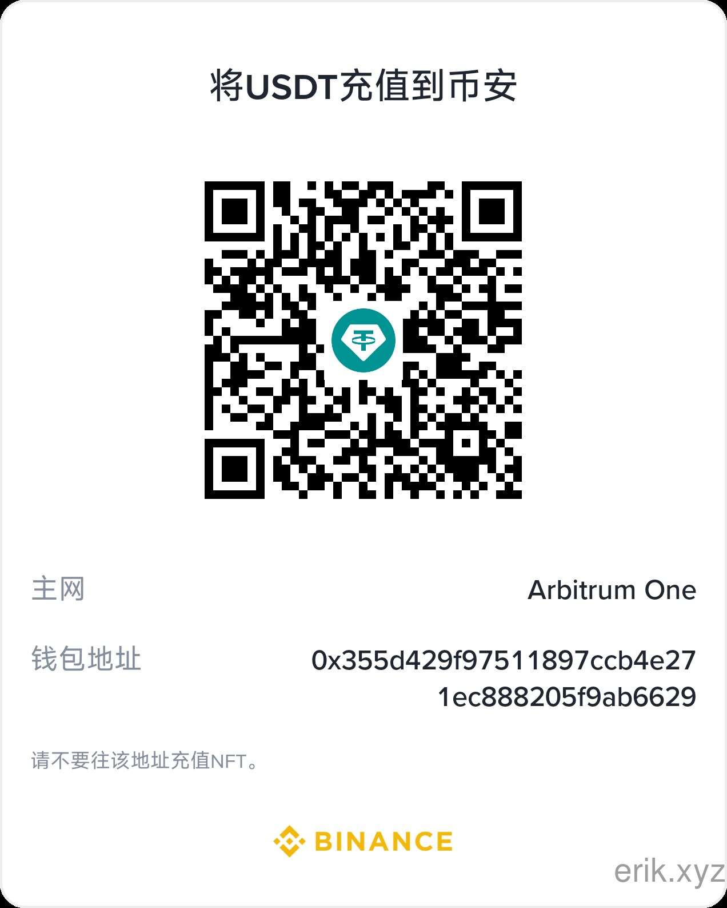

# IoT Платформа

[中文](../../README.md) | [English](README.en.md) | [한국어](README.ko.md) | [Русский](README.ru.md) | [Deutsch](README.de.md) | [Français](README.fr.md) | [Español](README.es.md) | [Português](README.pt.md) | [हिन्दी](README.hi.md) | [العربية](README.ar.md) | [বাংলা](README.bn.md) | [Bahasa Indonesia](README.id.md) | [日本語](README.ja.md)

<p align="center">
  
</p>

Единая SaaS-платформа Интернета вещей, объединяющая ведущих производителей устройств (Tuya, Xiaomi, Huawei, AWS IoT, Azure IoT и др.), с управлением устройствами, моделями вещей, правилами и оповещениями, временными рядами, CDN-доставкой и мультиплатформенными приложениями. Бэкенд — микросервисы на Rust (рабочая область e-cat), фронтенд — Flutter + HarmonyOS, поддержка 13 языков.

## Возможности

- **Подключение вендоров**: OAuth cloud-to-cloud (Tuya / Xiaomi / Huawei / AWS / Azure) + прямой MQTT (mTLS)
- **Модель вещей**: единое моделирование свойств / событий / сервисов — моделирование в админке, динамический рендеринг в клиенте
- **Жизненный цикл устройства**: регистрация → включение / отключение → отвязка → удаление, статус онлайн / офлайн во время работы
- **Правила и оповещения**: пороговые правила, автоматизация сценариев, push через WebSocket в реальном времени
- **Данные и отчёты**: хранение временных рядов в TDengine, исторические кривые, экспорт CSV/Excel
- **Управление CDN**: конфигурация вендора, включение / отключение, обновление и прогрев, подписанные URL
- **Мультитенантный SaaS**: изоляция тенантов, квоты, роли (admin / operator / read-only)
- **Безопасность**: входящее сканирование security-rust, JWT + RBAC, взаимный TLS, шифрование учётных данных AES, лимиты и автоматический выключатель
- **i18n на 13 языках**, Flutter Web / Mobile и нативные HarmonyOS (4 приложения)

## Архитектура



## Схемы подключения устройств



## Карта функций



## Жизненный цикл



## Архитектура безопасности



## Технологический стек

| Слой | Технология |
|----|------|
| Фронтенд | Flutter (Web / Mobile) · HarmonyOS ArkTS |
| Бэкенд | Rust (axum · tokio · gRPC) · сканирование security-rust |
| Промежуточный слой | EMQX (MQTT) · Kafka (шина событий) · gRPC (внутренний RPC) |
| Хранилище | MySQL 8 (метаданные) · TDengine (временные ряды) · Redis (тень / кэш) · S3 / MinIO (объекты) |
| Подключение | Адаптеры OAuth cloud-to-cloud · прямой MQTT (mTLS) |

## Структура репозитория

```
├── apps/            # Фронтенд-приложения
│   ├── admin/       # Консоль администратора (Flutter + HarmonyOS)
│   └── client/      # Клиентское приложение (Flutter + HarmonyOS)
├── e-cat/           # Rust-рабочее пространство (фреймворк + бизнес-сервисы в одном)
│   └── ecat*/       # Крейты фреймворка и бизнес-сервисы (ecat · ecat-auth · ecat-gateway · ecat-device · ecat-access · ecat-rule · ecat-data-service · ecat-data-* …)
├── ../            # Документация, диаграммы, изображения для донатов
├── scripts/         # Скрипты сборки / проверки / смоук-тестов
└── docker-compose.yml  # Инфраструктура (MySQL / Redis / EMQX / Kafka / MinIO)
```

## Этапы внедрения

| Этап | Содержание |
|------|------|
| P0 Скелет | Структура репозитория, iot-gateway + iot-device + Docker-оркестрация (MySQL/Redis/EMQX/Kafka/MinIO) |
| P1 Подключение | iot-access + адаптер Tuya + прямой MQTT |
| P2 Данные | iot-data + TDengine + исторические кривые |
| P3 Правила | iot-rule оповещения + автоматизация сценариев |
| P4 Вендоры + CDN | Адаптеры Xiaomi/Huawei/AWS/Azure + iot-cdn |
| P5 Фронтенд | apps/admin + apps/client полностью |
| P6 Запуск | Усиление безопасности, нагрузочное тестирование, OTA |

## Поддержка и донаты

Ваша поддержка — движущая сила проекта. Донаты приветствуются, огромное спасибо!

### Донат по QR-коду (WeChat Pay / Alipay)

<p>
  
  
</p>

WeChat Pay · Alipay

### Международный банковский перевод

**【Информация о получателе】**
Имя получателя: WANG KEXUN
Номер счёта: 881015918251

**【Банк получателя】ZA Bank**
- SWIFT-код: AABLHKHHXXX
- Название банка: ZA Bank Limited
- Код банка: 387
- Адрес банка: Core F, Cyberport 3, 100 Cyberport Road, Hong Kong

**【Банк-корреспондент для международных переводов (при необходимости)**】**
Обратите внимание: это информация о банке-корреспонденте (посреднике) для международных переводов, а не о банке получателя. Уточните в вашем банке, требуется ли информация о банке-корреспонденте.

- **Для переводов в HKD, CNY и USD банк-корреспондент — Citibank**
- Название банка: Citibank N.A. Hong Kong
- SWIFT-код: CITIHKHXXXX
- Код банка: 006
- Название отделения: Hong Kong Branch
- Код отделения: 391
- Адрес банка: Citibank Tower, Citibank Plaza, 3 Garden Road, Central, Hong Kong

- **Для переводов в других валютах банк-корреспондент — BNY Mellon**
- Название банка: THE BANK OF NEW YORK MELLON
- SWIFT-код: IRVTUS3NXXX
- Адрес банка: THE BANK OF NEW YORK MELLON, 240 GREENWICH STREET, NEW YORK, United States

### Донат в криптовалюте

| Coin | Network | Wallet Address |
|------|---------|----------------|
| [](../coin/1.jpg) | BNB Smart Chain (BEP20) | `0x355d429f97511897ccb4e271ec888205f9ab6629` |
| [](../coin/2.jpg) | Tron (TRC20) | `TEdDHWLajt1XvqtPDWmQctdrJaC3pzZZzz` |
| [](../coin/3.jpg) | Ethereum (ERC20) | `0x355d429f97511897ccb4e271ec888205f9ab6629` |
| [](../coin/4.jpg) | Aptos | `0x836e3780edfc3f7b2372b39e2a1a3a5d7adfaccd96c726f21cfde1b50dd68030` |
| [](../coin/5.jpg) | Plasma | `0x355d429f97511897ccb4e271ec888205f9ab6629` |
| [](../coin/6.jpg) | Polygon POS | `0x355d429f97511897ccb4e271ec888205f9ab6629` |
| [](../coin/7.jpg) | Solana | `2hfhboHdmdrYsY25XfQSsEWxq5ip4EQsR7f4AzSRMUyr` |
| [](../coin/8.jpg) | The Open Network (TON) | `UQB9kFQohzmXUir9QSSZq01iwl9aQZIDdBpNmDklljRtCoGK` |
| [](../coin/9.jpg) | Arbitrum One | `0x355d429f97511897ccb4e271ec888205f9ab6629` |
| [](../coin/10.jpg) | AVAX C-Chain | `0x355d429f97511897ccb4e271ec888205f9ab6629` |

## Лицензия

Код этого проекта предоставлен только для обучения и обмена опытом.
